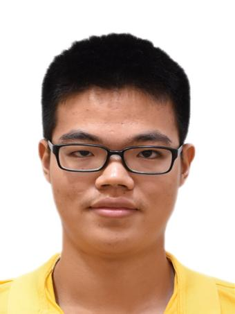
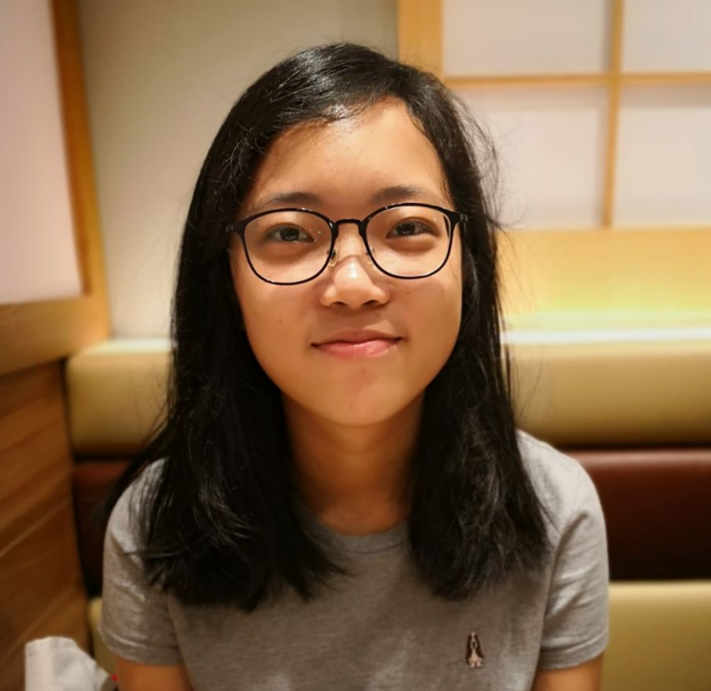
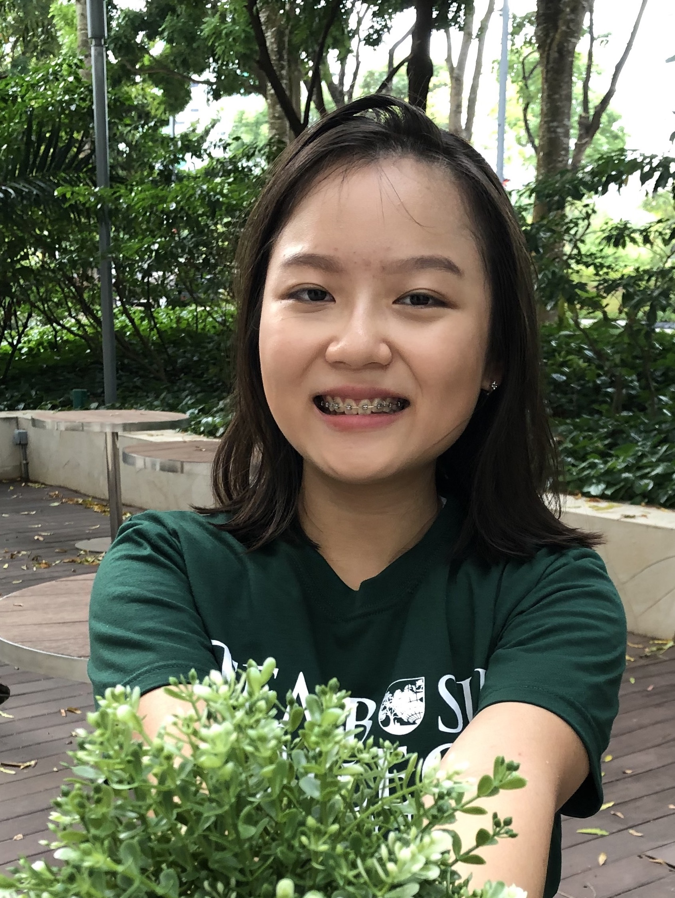
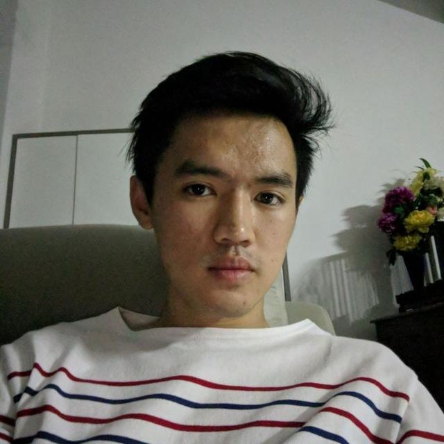
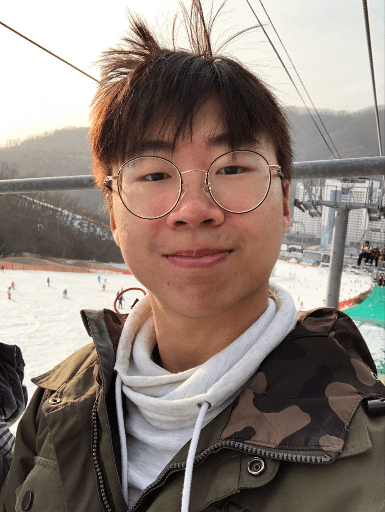

Our Productiv team is based in the [School of Computing, National University of Singapore](http://www.comp.nus.edu.sg).

You can contact us at `productiv@comp.nus.edu.sg` for any enquiries.

## Project team

### Cao Wenjie

[[github](https://github.com/shadowezz)]
[[portfolio](team/shadowezz.md)]

* Role: Developer
* Responsibilities: In charge of `Deliverable` features and Quality Assurance (Testing)

### Chrystal Quek Wan Qi

[[github](http://github.com/chrystalquek)] [[portfolio](team/chrystalquek.md)]

* Role: Developer
* Responsibilities: In charge of "Contact" and "Mode" features, as well as Quality Assurance (Testing)

### Clara Adora

[[github](https://github.com/claraadora)]
[[portfolio](team/claraadora.md)]

* Role: Developer
* Responsibilities: In charge of "Meeting" features and Product Management

### Merlin Lim

[[github](https://github.com/MerlinLim)]
[[portfolio](team/merlinlim.md)]

* Role: Developer
* Responsibilities: In charge of "Meeting" features and Documentation

### Tan Chang Ri, Gabriel

[[github](http://github.com/gabztcr)]
[[portfolio](team/gabztcr.md)]

* Role: Developer
* Responsibilities: In charge of "Deliverable" features and Documentation
