* Table of Contents
{:toc}

--------------------------------------------------------------------------------------------------------------------

## **Setting up, getting started**

Refer to the guide [_Setting up and getting started_](SettingUp.md).

--------------------------------------------------------------------------------------------------------------------

## **Design**

### Architecture

The ***Architecture Diagram*** given above explains the high-level design of Productiv (referred to as "the App" or "the application"). Given below is a quick overview of each component.

:bulb: **Tip:** The `.puml` files used to create diagrams in this document can be found in the [diagrams](https://github.com/AY2021S1-CS2103T-F11-2/tp/blob/master/docs/diagrams/) folder. Refer to the [_PlantUML Tutorial_ at se-edu/guides](https://se-education.org/guides/tutorials/plantUml.html) to learn how to create and edit diagrams.

<<<<<<< HEAD
**`Main`** has two classes called [`Main`](https://github.com/AY2021S1-CS2103T-F11-2/tp/blob/master/src/main/java/seedu/address/Main.java) and [`MainApp`](https://github.com/AY2021S1-CS2103T-F11-2/tp/blob/master/src/main/java/seedu/address/MainApp.java). It is responsible for,
* At app launch, initialising the components in the correct sequence, and connects them up with each other.
* Upon exiting, shutting down the components and invoking cleanup methods where necessary.

[**`Commons`**](#common-classes) represents a collection of classes used by multiple other components.  

The rest of the App consists of four components.

* [**`UI`**](#ui-component): Handles the UI of the App.
* [**`Logic`**](#logic-component): Executes commands supplied to the App.
* [**`Model`**](#model-component): Holds the data of the App in memory.
* [**`Storage`**](#storage-component): Reads data from, and writes data to, the hard disk.

The app contains 3 types of entities: Deliverable, Meeting and Person

Each of the four components:

* defines its *API* using a `{Component}{Entity}` interface.
* exposes its functionality using a concrete `{Component}{Entity}Manager` class (which implements the corresponding 
API `interface` above.)

For example, the `Logic` component (see the class diagram given below) defines its API in the `Logic{Entity}.java` interface 
and exposes its functionality using the `Logic{Entity}Manager.java` class which implements the `Logic{Entity}` interface.)

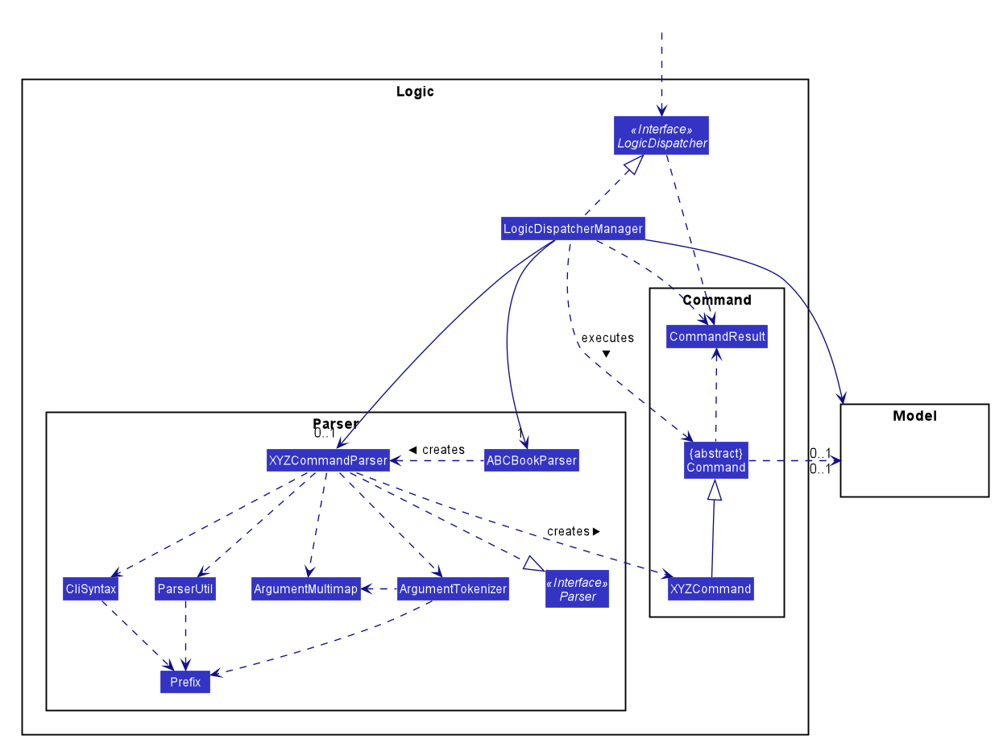

**How the architecture components interact with each other**

The sequence diagram below shows how the components interact with each other for the scenario where the user issues the command `delete 1` in the deliverable, meeting, or contact mode.

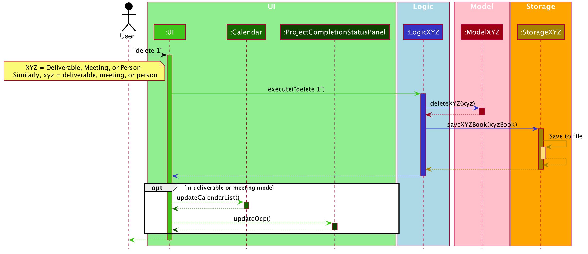

### UI component

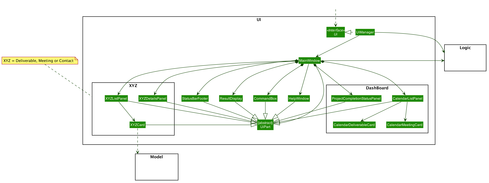

**API** :
[`Ui.java`](https://github.com/AY2021S1-CS2103T-F11-2/tp/blob/master/src/main/java/seedu/address/ui/Ui.java)

The UI consists of a `MainWindow` that is made up of parts e.g.`CommandBox`, `ResultDisplay`, `PersonListPanel`, `PersonDetailsPanel`, `CalendarListPanel`,
 `ProjectCompletionStatusPanel`, `StatusBarFooter` etc. All these, including the `MainWindow`, inherit from the abstract `UiPart` class.

 The `Dashboard` parts of the UI are displayed when the application is in dashboard mode. The left side of the application consists of
 the `ProjectCompletionStatusPanel` where the user can see the overall completion status of his/her product based on the
 percentage of deliverables completed. The right side consists of the `CalendarListPanel` which displays a list of deliverables
 and meetings, through `CalendarDeliverableCard` and `CalendarMeetingCard` respectively, in chronological order so that the user can
 keep track of his/her schedule.

 When the application is in deliverable, meeting or contact mode, the respective UI parts will be displayed. For example,
 in deliverable mode, the left side of the application will contain the `DeliverableListPanel`, consisting of `DeliverableCard`,
 to show the list of deliverables the user has. The right side consists of the `DeliverableDetailsPanel` which will display the full details
 of the deliverable that the user is viewing or just performed an operation on. The same idea is applicable for meeting and contact mode.
  

The UI component uses JavaFX UI framework. The layout of these UI parts are defined in matching `.fxml` files that are in the `src/main/resources/view` folder. For example, the layout of the [`MainWindow`](https://github.com/AY2021S1-CS2103T-F11-2/tp/blob/master/src/main/java/seedu/address/ui/MainWindow.java) is specified in [`MainWindow.fxml`](https://github.com/AY2021S1-CS2103T-F11-2/tp/blob/master/src/main/resources/view/MainWindow.fxml)

The UI component:

* Executes user commands using the Logic component.
* Listens for changes to Model data so that the UI can be updated with the modified data.

### Logic component

**API** :  
* [`LogicDeliverable.java`](https://github.com/AY2021S1-CS2103T-F11-2/tp/tree/master/src/main/java/seedu/address/logic/LogicDeliverable.java)
* [`LogicMeeting.java`](https://github.com/AY2021S1-CS2103T-F11-2/tp/tree/master/src/main/java/seedu/address/logic/LogicMeeting.java)
* [`LogicPerson.java`](https://github.com/AY2021S1-CS2103T-F11-2/tp/tree/master/src/main/java/seedu/address/logic/LogicPerson.java)
* [`LogicDispatcher.java`](https://github.com/AY2021S1-CS2103T-F11-2/tp/tree/master/src/main/java/seedu/address/logic/LogicDispatcher.java)

The Logic component parses the user commands and executes them. 
`LogicDispatcher` selects the correct `LogicXYZ` based on the current mode (e.g deliverable mode).  

This is the list of what Model components are affected:  
* `LogicDeliverable`: Component that affects `DeliverableModel` when in deliverable mode.
* `LogicMeeting`: Component that affects `MeetingModel` when in meeting mode.
* `LogicPerson`: Component that affects `PersonModel` when in contact mode.

Commands that do not affect Model components will be passed to `GeneralParser` when in any mode.

The components follow the general sequence to execute a command:

1. `LogicDispatcherManager` dispatches commands to
    1. `LogicXYZManager` class to execute and parse the user command which affect models
    1. `GeneralCommandParser` class to parse user commands which do not affect models
1. This results in a `ABCCommand` object which is executed by the `LogicDispatcherManager`.
1. The result of the command execution is encapsulated as a `CommandResult` object which is passed back to `Ui`.
1. In addition, `CommandResult` can also instruct `Ui` to perform certain actions, such as displaying help or switching mode for the user.

Given below is the Sequence Diagram for interactions within the Logic component for API call of any command. 

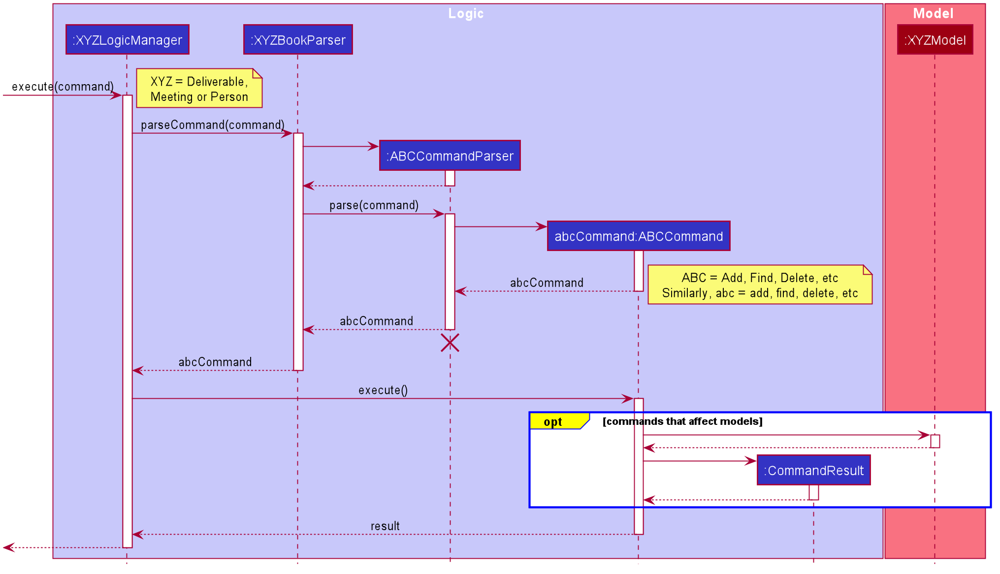

:information_source: 
**Note:** The lifeline for `ABCCommandParser` should end at the destroy marker (X) 
but due to a limitation of PlantUML, the lifeline reaches the end of diagram. 

### Model component

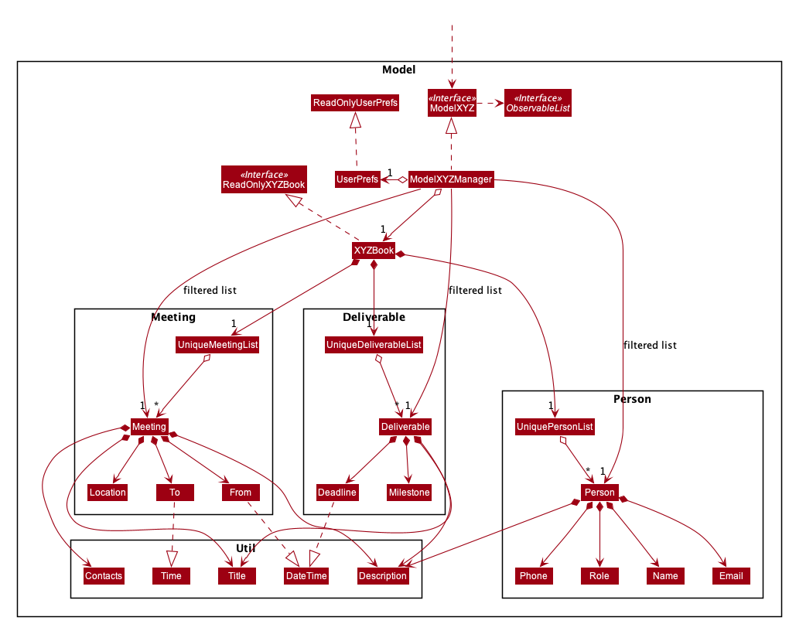

**API** : 
[`ModelDeliverable.java`](https://github.com/AY2021S1-CS2103T-F11-2/tp/blob/master/src/main/java/seedu/address/model/deliverable/ModelDeliverable.java), 
[`ModelMeeting.java`](https://github.com/AY2021S1-CS2103T-F11-2/tp/tree/master/src/main/java/seedu/address/model/meeting/ModelMeeting.java), 
[`ModelPerson.java`](https://github.com/AY2021S1-CS2103T-F11-2/tp/blob/master/src/main/java/seedu/address/model/person/ModelPerson.java)

The Model component (`ModelDeliverable`, `ModelMeeting` or `ModelPerson`),

* stores a `UserPref` object that represents the user’s preferences.
* stores its respective deliverable, meeting, or person book. 
* exposes unmodifiable its respective `ObservableList<Deliverable>`,`ObservableList<Meeting>`, or `ObservableList<Person>`.
e.g. the UI can be bound to these lists so that the UI automatically updates when the data in the lists change.
* does not depend on any of the other three components.

### Storage component

**API** : 
[`StorageDeliverable.java`](https://github.com/AY2021S1-CS2103T-F11-2/tp/tree/master/src/main/java/seedu/address/storage/deliverable/StorageDeliverable.java)
[`StorageMeeting.java`](https://github.com/AY2021S1-CS2103T-F11-2/tp/tree/master/src/main/java/seedu/address/storage/meeting/StorageMeeting.java)
[`StoragePerson.java`](https://github.com/AY2021S1-CS2103T-F11-2/tp/tree/master/src/main/java/seedu/address/storage/person/StoragePerson.java)

The Storage component:
* can save `UserPref` objects in JSON format and read it back.
* can save the data in JSON format and read it back.

For saving files, storage follows this sequence:

1. When `XYZBook` is updated, `StorageXYZManagers` saves the newly updated book.
1. The newly updated book is passed to `JsonSerliazableXYZBook`.
1. Each item in `XYZBook` is serialized by `JsonAdaptedXYZ` before overwriting the current json files.

Given below is the sequence diagram for data being stored.

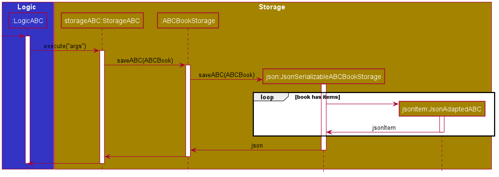

For reading files, based on the `UserPrefs` provided, storage will find the JSON Files and load the data from there. 

:information_source: 
**Note:** 
If the JSON files are missing or if the path is missing, a new set of JSON files will be generated with a set of sample items.

### Common classes

Classes used by multiple components are in the `seedu.addressbook.commons` package.

--------------------------------------------------------------------------------------------------------------------

## **Implementation**

This section describes some noteworthy details on how certain features are implemented.
### Date and Time Verification

#### Implementation
The implementation allows users to parse and compare unique `DateTime` and `Time` types.

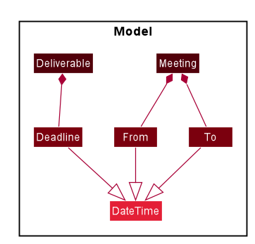

**`Time`**: To parse, `Time` should be in the following format: **`HH:mm`** 
* Single digit fields must include leading zero: `01:10`.

`Time` will throw a parsing error if
* Format is wrong (e.g missing or additional digit): `00:00:59`
* Invalid range (e.g beyond max limit): `24:00` 

**`DateTime`**: To parse, `DateTime` should be in the following format: **`dd-MM-yyyy HH:mm`** 
* Single digit fields must include leading zero: `01-01-0101 01:10`.
* Valid Calendar Range: \[`01-01-2019 00:00` - `31-12-9999 23:59`\].

`DateTime` will throw a parsing error if
* Format is wrong (e.g missing or additional digit): `1-10-2020 00:00:59` 
* Invalid range (e.g invalid leap year): `31-02-2020 00:00`

DateTime can be used to compare with other DateTime objects:
* Enable deliverables or meetings to be sorted based on which one is due the earliest.
*Refer to [Auto-sort feature](#auto-sort-feature) to view this implementation.*
* Ensures `From` in meeting is strictly before `To` (e.g Throw error for command `edit 1 from/01-01-2020 23:59 to/00:00` in meeting mode).
* DateTime can be used to identify time clashes between different meetings.

#### Design consideration
* **Alternative 1 (current choice):** Throws error when invalid range is 
given for dates
  * E.g `29-02-2019 00:00` or `31-11-2020 00:00`.
  * Pros: Notifies user he has made a mistake.
  * Cons: Costs time to re-type the entire command.
  
* **Alternative 2:** Command knows how to resolve overflow of dates. 
    * E.g `29-02-2019 00:00` will be resolved automatically to `28-02-2019 00:00` the `MAX number of days of the month`.
    * Pros: Saves time for the user if he had intended to select the last day of the month.
    * Cons: The date specified may not be the intended input.

### Auto-sort feature

#### Implementation

The Auto-sort feature allows users to view `Deliverable`s, `Meeting`s, and `Person`s in a logical manner. 
Specifically, the Auto-sort feature automatically sorts `Deliverable`s, `Meeting`s, and `Person`s by the following attributes: 

* `Meeting`   - its `From`'s `LocalDateTime` value in ascending chronological order 
* `Deliverable`  - its `Deadline`'s `LocalDateTime` value in ascending chronological order 
* `Person`   - its `Name`'s `String` value in ascending alphabetical order 

Auto-sort is facilitated by custom classes that implements `Comparator`.

The following sequence diagram shows how a list is auto-sorted upon an addition of a `Meeting`.

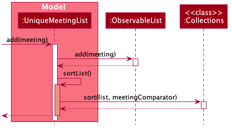

#### Design consideration

##### Aspect: How auto-sorting executes

* **Alternative 1 (current choice):** Sorts a list upon an addition or update of an element.
    * Pros: Error-free and easy to implement.
    * Cons: Relatively high time complexity i.e. O(nlogn).
* **Alternative 2:** Searches the correct index in the list to insert an element upon addition or update.
    * Pros: Relatively low time complexity i.e. O(logn).
    * Cons: Prone to error and difficult to implement.
    
### Calendar feature

#### Implementation

The Calendar feature allows users to view their `Deliverable`s and`Meeting`s together in one chronologically ordered list - `calendarList`. 
Specifically, the Calendar feature combines and orders `Deliverable`s and `Meeting`s by the following attributes: 

* `Meeting`   - its `From`'s `LocalDateTime` value 
* `Deliverable`  - its `Deadline`'s `LocalDateTime` value

The combining is done by applying polymorphism; `Deliverable` and `Meeting` implement the interface `TimeEvent`.
The following class diagram demonstrates the above-mentioned polymorphism. 
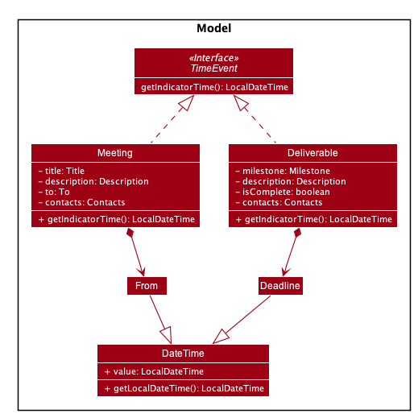

Meanwhile, the ordering is facilitated by the [Auto-sort feature](#auto-sort-feature).

The following sequence diagram shows how the Calendar is updated upon an addition of a `Deliverable`.

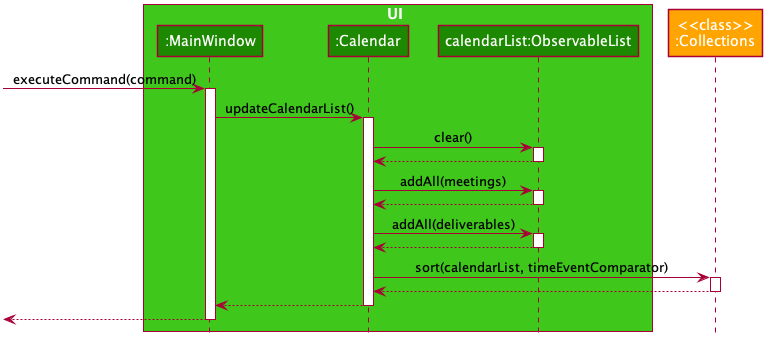

#### Design consideration

##### Aspect: Where and how is `calendarList` updated

* **Alternative 1 (current choice):** `calendarList` is in the UI component, and for any change in `UniqueDeliverableList`'s or `UniqueMeetingList`'s `internalList`: 
  1. `calendarList` is cleared 
  1. both `internalList`s' elements are added into `calendarList`
  1. `calendarList` is sorted
  * Pros: Coupling is reduced as the implementation of `UniqueDeliverableList` and `UniqueMeetingList` are unmodified.
  * Cons: Relatively high time complexity as any update to the `internalList`s requires clearing, adding back all `internalList`s' elements, and sorting `calendarList`. 
    This is required because `calendarList`, which is not in `UniqueDeliverableList` and `UniqueMeetingList`, has no direct access to the item being updated. 
* **Alternative 2:** `calendarList` is in `UniqueDeliverableList` and `UniqueMeetingList` as references, and for any change in `UniqueDeliverableList`'s or `UniqueMeetingList`'s `internalList`: 
  1. `calendarList` is updated in the same way as the `internalList` involved. 
  This is possible because the `calendarList`, which is in `UniqueDeliverableList` and `UniqueMeetingList`, has direct access to the element being updated. 
  * Pros: Lower time complexity compared to Alternative 1, as both clearing and adding back all `internalList`s' elements are not needed. 
  * Cons: Coupling is increased as the implementation of `UniqueDeliverableList` and `UniqueMeetingList` are modified
    i.e. both hold and update `calendarList` (on top of `internalList`) for any update.

### Done feature

#### Implementation

The Done feature allows users to mark their deliverables as completed. 

1. The user input is received by `MainWindow` in the `UI` component before being passed to `DeliverableLogicManager` through `LogicDispatcherManager` to be executed. 
1. `DeliverableLogicManager` will call `DeliverableBookParser` which will parse the command keyword ("done") to return a `MarkDoneCommandParser`. 
1. `MarkDoneCommandParser` will then parse the command argument to return a `MarkDoneCommand`.
1. On execution, `MarkDoneCommand` will set the status of the specified deliverable to completed and update the `ModelDeliverable` accordingly. 

Invalid user inputs such as an invalid index will result in the appropriate error messages displayed to the user.

Given below is a sequence diagram to show how the done operation works at each step.

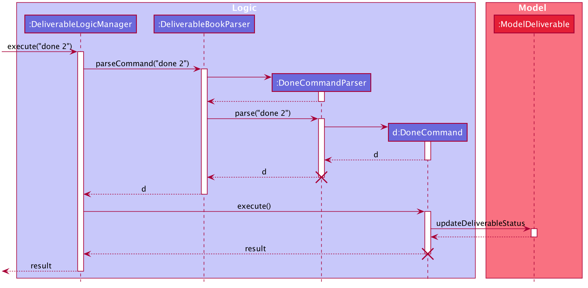

#### Design Considerations

##### Aspect: How `done` is implemented

* **Alternative 1 (current choice):** Have a separate command `done` for marking deliverables as completed.
    * Pros: Clearer and easier for the user. Prevents the `edit` command from being too cluttered with too many
    editable fields.
    * Cons: More code and testing required as there are additional classes created such as `MarkDoneCommand` and 
    `MarkDoneCommandParser`.
* **Alternative 2:** Allow users to mark deliverables as completed through the existing `edit` command by changing 
the completion status field of the deliverable
    * Pros: Less code required since we only need to make small amendments to the existing `EditCommand` and `EditCommandParser`.
    * Cons: Format of the command will be more complex and confusing for the user. Instead of just having to pass in the index
    of deliverable, we will need to provide a prefix (e.g. s/) and a string to represent the completion status to edit to (e.g. edit 1 s/complete).

### Switch Mode feature

#### Implementation

The switch mode feature allows users to switch to any of the modes of the application.
The application can be in any one of these modes: dashboard, deliverable, meeting and contact mode.
Based on the current mode, user input is passed to the corresponding `LogicManager`,
e.g. if the user is in deliverable mode, user input is passed to `LogicDeliverableManager`.
Based on the current mode, the `Ui` updates with information related to that mode.

The mode of the application can be switched via CLI or mouse input.

Via CLI:
1. The user input is received by the `MainWindow` in the `Ui` component and passed to `LogicDispatcherManager`.
`LogicDispatcherManager` is the 'gatekeeper' of the Logic component. 
1. `LogicDispatcherManager` will identify the user input as a `General` command and call `GeneralParser`.
1. `GeneralParser` will create a `SwitchCommandParser`. `SwitchCommandParser` will then parse the arguments in the user input to return a `SwitchCommand`.
1. This `SwitchCommand` is passed back to `LogicDispatcherManager`.
1. `LogicDispatcherManager` will then call the execute method of `SwitchCommand` which returns a `CommandResult` containing the mode that the application should switch to.
1. This `CommandResult` is passed back to `MainWindow`.
1. Then, `MainWindow` will retrieve the new mode from the `CommandResult`.
1. Based on the new mode, `MainWindow` will update its own attribute `mode`.
`MainWindow` will also update the UI to only show information related to the new mode.

For the command, a `SwitchCommandParser` is implemented to parse the input into a mode.
Invalid arguments (any argument other than `dv`, `db`, `m` and `c`) are also handled properly, with suitable error messages being displayed to the user.

Given below is a sequence diagram to show how the switch mode mechanism behaves for CLI.

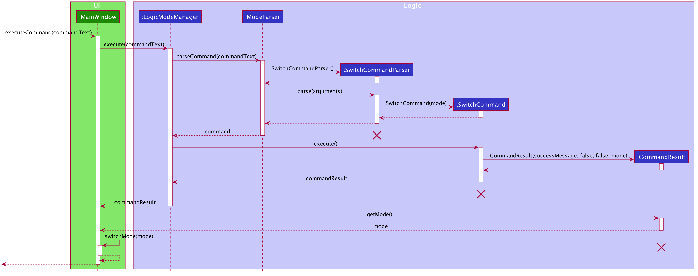

Given below is an activity diagram to show how the switch mode operation works for CLI.

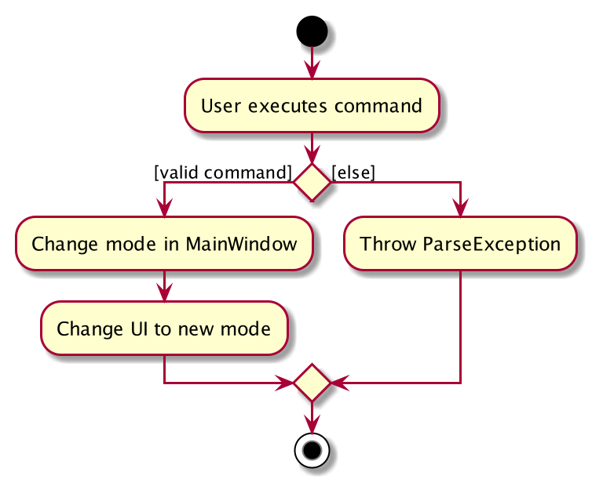

Via mouse input:
There is no interaction with the logic component. The only steps are:
1. The `MainWindow` detects that a button on the navigation bar is clicked, e.g. if Deliverable is clicked, `switchDeliverable` method of `MainWindow` is called.
1. The `MainWindow` will update its own attribute `mode` and the UI to only show information related to the new mode.

Given below is a sequence diagram to show how the switch mode mechanism behaves for mouse input.

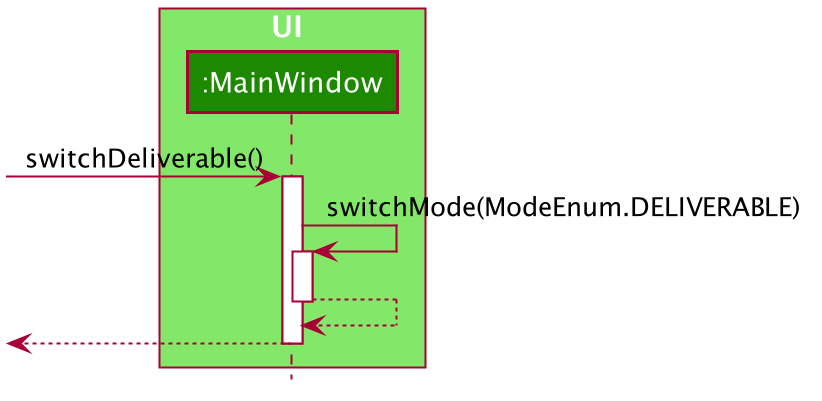
<figcaption>The two sequence diagrams are separated for simplicity</figcaption>

#### Design consideration

##### Aspect: How Switch commands should be implemented

* **Alternative 1 (current choice):** Shortened user commands: `switch` `db`, `dv`, `m` or `c`.
  * Pros: More convenient and faster to type shorter user commands.
  * Cons: More difficult for users to remember short forms.

* **Alternative 2 (original implementation):** Longer user commands: `switch` `dashboard`, `deliverable`, `meeting` or `contact`.
  * Pros: Clearer as commands correspond to the naming of tabs on the navigation bar.
  * Cons: Takes longer to type longer user commands.

##### Aspect: Where mode is stored

* **Alternative 1 (current choice):** Store mode in `MainWindow`.
  * Pros: `MainWindow` can update UI easily by accessing current mode.
  * Cons: Need to keep passing current mode to `LogicDispatcherManager`.

* **Alternative 2:** Store mode in both `MainWindow` and `LogicDispatcherManager`.
  * Pros: Easier implementation. No need to keep passing current mode to `LogicDispatcherManager`.
  * Cons: No single source of truth, could lead to bugs.

### View feature

#### Implementation

The view feature allows users to view the details of a specific deliverable, meeting or contact on the right
panel of the display window, depending on the mode the application is in. 

1. Suppose the user in currently in the meeting mode, the user input received by `MainWindow` in `UI` component will be passed to `MeetingLogicManager` through `LogicDispatcherManager` to be executed. 
1. `MeetingLogicManager` will call `MeetingBookParser` which will parse the command keyword ("view") to return a `ViewCommandParser`. 
1. `ViewCommandParser` will then parse the command argument to return a `ViewCommand`.
1. On execution, `ViewCommand` will update the `ModelMeeting` to set the meeting currently in view. 
1. `UI` component will then make a separate call to `ModelMeeting` to retrieve the meeting currently in view and display its full details to the user in the right panel of the application.

Invalid user inputs such as an invalid index will result in the appropriate error messages displayed to the user. 

The following sequence diagram shows how the view operation works in each step:

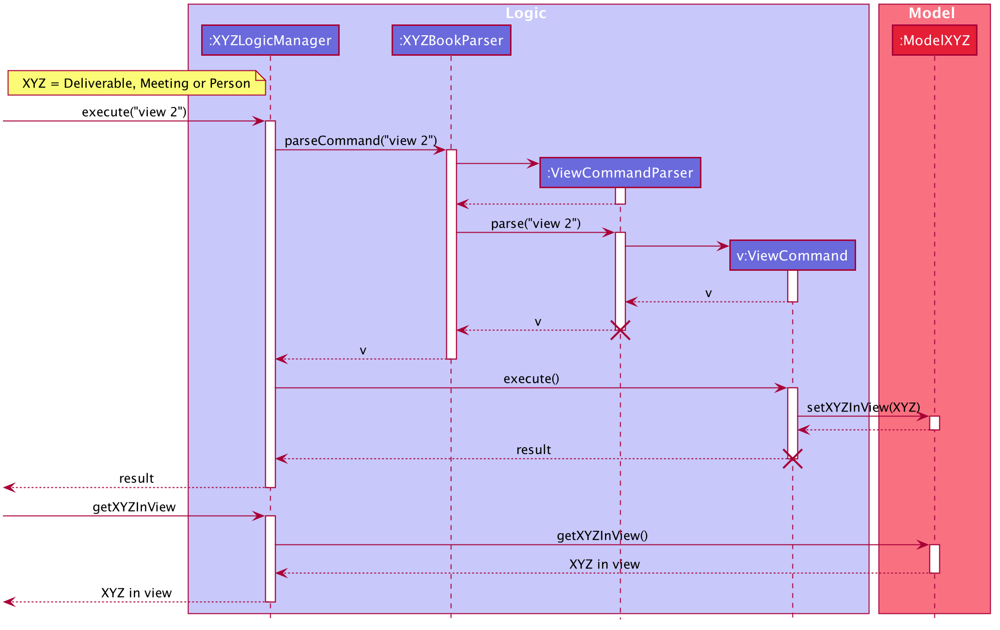

#### Design consideration

##### Aspect: How view executes

* **Alternative 1 (current choice):** Stores the item in view inside the respective model.
  * Pros: Ensures persistence as it can be referred to repeatedly.
  * Cons: Requires another operation to fetch the item in view to be displayed.

* **Alternative 2:** Passes the item in view inside the Command Result to the UI component
  * Pros: Does not require an additional operation to fetch the item in view.
  * Cons: Cluttering of Command Result object which now needs to store mode-specific items. This is against its original purpose 
  which is to pass mode-neutral information, such as error messages, back to UI for display after a command execution.

### Overall Completion Percentage feature

#### Implementation

The Overall Completion Percentage (OCP) feature is located at the left panel of the dashboard in Productiv.
It is a donut chart implemented with the third-party library [fx-progress-circle](https://github.com/torakiki/fx-progress-circle/),
and it appears as shown below.

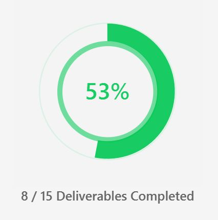

The OCP feature allows product managers to have a quick overview of the progress of their product's development 
so that they can work better towards production deadlines. 
OCP is given by the 
formula*:

**_OCP (%) = Number of Completed Deliverables / Total Number of Deliverables × 100_**

\* If no deliverables exist, OCP will be set to **0%**.

The OCP will be updated upon switching to dashboard mode. 
This can be done via CLI (with the command `switch db`) or mouse input (clicking on the dashboard tab).

The following steps and sequence diagram shows how the **updating** of the OCP is implemented via mouse input.
You should note the mechanism after the mode has been switched.

1. `MainWindow` detects that the dashboard button in the navigation bar is clicked, and its `switchDashboard` method is called.
2. `MainWindow` updates its own attribute `mode` to reflect the dashboard and its UI displays it accordingly.
3. The `updateOcp` method of `ProjectCompletionStatusPanel` is called.
4. `ProjectCompletionStatusPanel` calls the `size` method of its `deliverableList` (of type `ObservableList`), which returns the total number of deliverables (`totalNumDeliverables`).
5. `ProjectCompletionStatusPanel` self-invokes its `findNumCompletedDeliverables` method that returns the number of completed deliverables of its `deliverableList` (`numCompletedDeliverables`).
6. `ProjectCompletionStatusPanel` self-invokes its `getOcp` method with `totalNumDeliverables` and `numCompletedDeliverables` as parameters, and returns the `overallCompletionPercentage`*.

*This value is later passed to the progress ring indicator to render the OCP donut chart in the dashboard. 

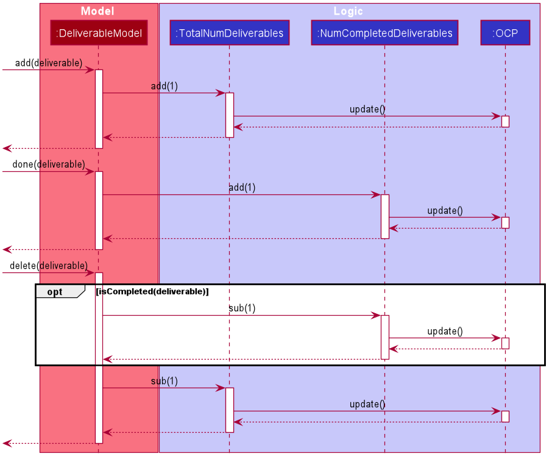

#### Design consideration

##### Aspect: How updating of OCP executes

* **Alternative 1 (current choice):** Calculate OCP on-the-go only upon switching to dashboard mode.
    * Pros: Less prone to calculation errors.
    * Cons: Takes slightly longer to calculate OCP for display.
* **Alternative 2:** Have a global variable for OCP that updates upon any relevant change to the deliverable list.
    * Pros: Potentially faster to retrieve OCP information for display (using a getter method).
    * Cons: More prone to errors from higher frequency of calculation.

--------------------------------------------------------------------------------------------------------------------

## **Documentation, logging, testing, configuration, dev-ops**

* [Documentation guide](Documentation.md)
* [Testing guide](Testing.md)
* [Logging guide](Logging.md)
* [Configuration guide](Configuration.md)
* [DevOps guide](DevOps.md)

--------------------------------------------------------------------------------------------------------------------

## **Appendix A: Product Scope**

**Target user profile**:

* has a need to manage a significant number of contacts
* has a need to manage a meeting schedule
* has a need to oversee the development of a product
* prefers to have product-related information in a single application
* prefer desktop apps over other types of apps
* can type fast
* prefers typing to mouse interactions
* is reasonably comfortable using CLI apps

**Value proposition**: 
* consolidates product-related information such as deliverables, meetings and contacts into one place
* manage their product’s development more comprehensively and conveniently than a typical mouse/GUI driven app

## **Appendix B: User Stories**

Priority Legend: 
* `* * *` - High (must be addressed)
* `* *` - Medium (would be nice to address)
* `*` - Low (least likely to be addressed) 

| Priority   | As a ...                                   | I can ...                                                                   | So that I can ...                                          |
| ---------- | ------------------------------------------ | --------------------------------------------------------------------------- | ---------------------------------------------------------- |
| **EPIC A** | Product Manager                            | track my product’s deliverables                                             | work better towards meeting them                           |
| `* * *`    | Product Manager                            | add deliverables for the product                                            | keep track of them                                         |
| `* * *`    | Product Manager                            | mark deliverables as completed                                              | know which ones I've done                                  |
| `* * *`    | Product Manager                            | delete deliverables that are no longer relevant                             | focus on other deliverables                                |
| `* *`      | Product Manager                            | edit the details of the deliverables                                        | keep them updated                                          |
| `* *`      | Product Manager                            | tag deliverables to different milestones                                    | distinguish the deliverables easily                        |
| `* *`      | Product Manager                            | add contacts under my deliverables                                          | know who is involved in meeting the deliverable            |
| `* *`      | Product Manager                            | edit a deliverable which was wrongly marked done back to its original status| ensure my deliverables are reflected correctly             |
| `* *`      | Product Manager with many deliverables     | search for specific ones                                                    | easily find them from my entire list                       |
| `* *`      | Product Manager with many deliverables     | have my deliverables sorted chronologically by deadline                     | look out for more urgent deliverables                      |
| `* *`      | Product Manager                            | be informed when a deliverable is close to its deadline or has passed it    | know which deliverables need more attention                |
| **EPIC B** | Product Manager                            | manage my product-related meetings                                          | be clear on my meeting schedule                            |
| `* * *`    | Product Manager                            | add new meetings that I'm scheduled for                                     | keep track of them                                         |
| `* * *`    | Product Manager                            | delete my scheduled meetings                                                | remove outdated or cancelled meetings                      |
| `* *`      | Product Manager                            | edit the details of my scheduled meetings                                   | keep them updated                                          |
| `* *`      | Product Manager                            | add contacts and location under my meetings                                 | know who is involved and where the meeting is taking place |
| `* *`      | Product Manager with many meetings         | search for specific ones                                                    | easily find them from my entire list                       |
| `* *`      | Product Manager with many meetings         | have my meetings sorted chronologically by its start time                   | look out for the earlier meetings that were scheduled      |
| `* *`      | Product Manager                            | be informed when a meeting is close to starting, on-going or has ended      | be updated on the status of my meetings                    |
| **EPIC C** | Product Manager                            | organise my developer or stakeholder contacts                               | reference them easily                                      |
| `* * *`    | Product Manager                            | add contacts related to the product                                         | store their details for future communication               |
| `* * *`    | Product Manager                            | distinguish between developers and stakeholders in a project easily         | remember their respective roles                            |
| `* * *`    | Product Manager                            | delete contacts that are no longer relevant                                 | forget about unimportant contacts                          |
| `* *`      | Product Manager                            | edit the details of my contacts                                             | keep them updated                                          |
| `* *`      | Product Manager with many contacts         | search for specific ones                                                    | easily find them from my entire list                       |
| `* *`      | Product Manager with many contacts         | have my contacts sorted by alphabetical order                               | keep my contact list organised                             |
| **EPIC D** | Product Manager                            | have an overview of my product's development and upcoming events            | work better towards production deadlines                   |
| `* *`      | Product Manager                            | view the overall completion of the product                                  | know the current progress of the product's development     |
| `* *`      | Product Manager                            | see a calendar view of my deliverables and meetings                         | know which product-related events are upcoming and urgent  |
| `*`        | Product Manager                            | toggle between daily, weekly and monthly view of the calendar               | have a variety of views to see my upcoming events          |
| **EPIC E** | forgetful or inexperienced Product Manager | view app instructions and tips                                              | be able to use it as intended                              | 
| `* * *`    | Product Manager                            | receive feedback from the app                                               | know the system has successfully registered my action      |
| `* *`      | Product Manager                            | get directions to the app's user guide                                      | easily access the relevant instructions                    |
| `*`        | Product Manager                            | view a shortcut reference                                                   | receive technical solutions immediately for command issues |

## **Appendix C: Use Cases**

For all use cases below, the **System** is `Productiv` and the **Actor** is the `user`.

### General

**Use case: G01 - Switch Mode**

**MSS**
1. User chooses to switch to another mode.
2. User enters the command to switch mode into the command box.
3. Productiv switches to the expected mode and displays a success message in the feedback box.

    Use case ends.

**Extensions**
* 2a. Productiv detects an error in the command.
     * 2a1. Productiv displays an error message in the feedback box.
     * 2a2. User enters the command again.
     * 2a3. Steps 2a1-2a2 are repeated until the command entered is correct.
       
       Use case resumes from step 3.

**Use case: G02 - Help**

**Precondition(s):**
* User has a stable internet connection.

**MSS**
1. User chooses to view instructions on how to use Productiv.
2. User enters the help command into the command box.
3. Productiv shows a help window with a copyable URL to its user guide and displays a success message in the feedback box.
4. User copies the link into their browser and is directed to the user guide.

    Use case ends.

**Extensions**
* 2a. Productiv detects an error in the command.
     * 2a1. Productiv displays an error message in the feedback box.
     * 2a2. User enters the command again.
     * 2a3. Steps 2a1-2a2 are repeated until the command entered is correct.

       Use case resumes from step 3.

**Use case: G03 - Exit**

**MSS**
1. User chooses to exit Productiv.
2. User enters the exit command into the command box.
3. Productiv closes.

    Use case ends.

**Extensions**
* 2a. Productiv detects an error in the command.
     * 2a1. Productiv displays an error message in the feedback box.
     * 2a2. User enters the command again.
     * 2a3. Steps 2a1-2a2 are repeated until the command entered is correct.
     
       Use case resumes from step 3.
       
### Deliverable

**Use case: D01 - Add a deliverable**

**Precondition(s):**
* User is in the deliverable mode.

**Guarantee(s):**
* The dashboard's OCP and Schedule will be updated accordingly.
* The added deliverable will be reflected in the left and right panels.

**MSS**
1. User chooses to add a deliverable.
2. User enters the command to add a deliverable into the command box.
3. Productiv adds the deliverable into the deliverable list and displays a success message in the feedback box.

    Use case ends.

**Extensions**
* 2a. Productiv detects an error in the command.
    * 2a1. Productiv displays an error message in the feedback box.
    * 2a2. User enters the command again.
    * Steps 2a1-2a2 are repeated until the command entered is correct.
      
      Use case resumes from step 3.
      
**Use case: D02 - Edit a deliverable**

**Precondition(s):**
* User is in the deliverable mode.
* Deliverable to edit exists.

**Guarantee(s):**
* The dashboard's Schedule will be updated accordingly.
* The edited deliverable will be reflected in the left and right panels.

**MSS**
1. User chooses to edit a deliverable.
2. User enters the command to edit a deliverable into the command box.
3. Productiv edits the deliverable accordingly and displays a success message in the feedback box.
   
   Use case ends.

**Extensions**
* 2a. Productiv detects an error in the command.
    * 2a1. Productiv displays an error message in the feedback box.
    * 2a2. User enters the command again.
    * Steps 2a1-2a2 are repeated until the command entered is correct.
      
      Use case resumes from step 3.

**Use case: D03 - Mark a deliverable as completed**

**Precondition(s):**
* User is in the deliverable mode.
* Deliverable to mark as completed exists.

**Guarantee(s):**
* The dashboard's OCP and Schedule will be updated accordingly.
* The deliverable marked as completed will be reflected in the left and right panels.

**MSS**
1. User chooses to mark a deliverable as completed.
2. User enters the command to mark a deliverable as completed into the command box.
3. Productiv marks the deliverable as completed and displays a success message in the feedback box.

    Use case ends.

**Extensions**
* 2a. Productiv detects an error in the command.
    * 2a1. Productiv displays an error message in the feedback box.
    * 2a2. User enters the command again.
    * Steps 2a1-2a2 are repeated until the command entered is correct.
      
      Use case resumes from step 3.
      
**Use case: D04 - Mark a deliverable as on-going**

**Precondition(s):**
* User is in the deliverable mode.
* Deliverable to mark as on-going exists.

**Guarantee(s):**
* The dashboard's OCP and Schedule will be updated accordingly.
* The deliverable marked as on-going will be reflected in the left and right panels.

**MSS**
1. User chooses to mark a deliverable as on-going.
2. User enters the command to mark a deliverable as on-going into the command box.
3. Productiv marks the deliverable as on-going and displays a success message in the feedback box.

    Use case ends.

**Extensions**
* 2a. Productiv detects an error in the command.
    * 2a1. Productiv displays an error message in the feedback box.
    * 2a2. User enters the command again.
    * Steps 2a1-2a2 are repeated until the command entered is correct.
      
      Use case resumes from step 3.
    
**Use case: D05 - View a deliverable**

**Precondition(s):**
* User is in the deliverable mode.
* Deliverable to view exists.

**MSS**
1. User chooses to view a deliverable.
2. User enters the command to view a deliverable into the command box.
3. Productiv displays the deliverable in the right panel and displays a success message in the feedback box.

    Use case ends.

**Extensions**
* 2a. Productiv detects an error in the command.
    * 2a1. Productiv displays an error message in the feedback box.
    * 2a2. User enters the command again.
    * Steps 2a1-2a2 are repeated until the command entered is correct.
      
      Use case resumes from step 3.  
    
**Use case: D06 - Find deliverables**

**Precondition(s):**
* User is in the deliverable mode.
* User has keyword(s) for Productiv to find deliverables with.

**Guarantee(s):**
* The right panel will be cleared.

**MSS**
1. User chooses to find deliverables.
2. User enters the command and keyword(s) to find deliverables into the command box.
3. Productiv returns all matching deliverables in the left panel and displays a success message in the feedback box.

    Use case ends.

**Extensions**
* 2a. Productiv detects an error in the command.
    * 2a1. Productiv displays an error message in the feedback box.
    * 2a2. User enters the command again.
    * Steps 2a1-2a2 are repeated until the command entered is correct.
      
      Use case resumes from step 3.  
      
**Use case: D07 - List all deliverables**

**Precondition(s):**
* User is in the deliverable mode.
* User has at least one existing deliverable in Productiv.

**Guarantee(s):**
* The right panel will be cleared.

**MSS**
1. User chooses to list all deliverables.
2. User enters the command to list all deliverables into the command box.
3. Productiv lists out all deliverables in the left panel and displays a success message in the feedback box.

    Use case ends.

**Extensions**
* 2a. Productiv detects an error in the command.
    * 2a1. Productiv displays an error message in the feedback box.
    * 2a2. User enters the command again.
    * Steps 2a1-2a2 are repeated until the command entered is correct.
      
      Use case resumes from step 3.  
      
**Use case: D08 - Delete a deliverable**

**Precondition(s):**
* User is in the deliverable mode.
* Deliverable to delete exists.

**Guarantee(s):** 
* The left panel will reflect the updated deliverable list.
* The right panel will be cleared.
* The dashboard's OCP and Schedule will be updated accordingly.
* The deleted deliverable will not have its data stored anymore in Productiv.
* The deleted deliverable cannot be retrieved back.

**MSS**
1. User chooses to delete a deliverable.
2. User enters the command to delete a deliverable into the command box.
3. Productiv deletes the deliverable from the deliverable list and displays a success message in the feedback box.
    
    Use case ends.

**Extensions**
* 2a. Productiv detects an error in the command.
    * 2a1. Productiv displays an error message in the feedback box.
    * 2a2. User enters the command again.
    * Steps 2a1-2a2 are repeated until the command entered is correct.
      
      Use case resumes from step 3.
      
**Use case: D09 - Clear all deliverables**

**Precondition(s):**
* User is in the deliverable mode.
* User has at least one existing deliverable in Productiv.

**Guarantee(s):** 
* The left and right panels will be cleared.
* The dashboard's OCP and Schedule will be updated accordingly.
* The cleared deliverables will not have its data stored anymore in Productiv.
* The cleared deliverables cannot be retrieved back.

**MSS**
1. User chooses to clear all deliverables.
2. User enters the command to clear all deliverables into the command box.
3. Productiv clears all deliverables from the deliverable list and displays a success message in the feedback box.
    
    Use case ends.

**Extensions**
* 2a. Productiv detects an error in the command.
    * 2a1. Productiv displays an error message in the feedback box.
    * 2a2. User enters the command again.
    * Steps 2a1-2a2 are repeated until the command entered is correct.
      
      Use case resumes from step 3.

### Meeting

**Use case: M01 - Add a meeting**

**Precondition(s):**
* User is in the meeting mode.

**Guarantee(s):**
* The dashboard's Schedule will be updated accordingly.
* The added meeting will be reflected in the left and right panels.

**MSS**
1. User chooses to add a meeting.
2. User enters the command to add a meeting into the command box.
3. Productiv adds the meeting into the meeting list and displays a success message in the feedback box.

    Use case ends.

**Extensions**
* 2a. Productiv detects an error in the command.
    * 2a1. Productiv displays an error message in the feedback box.
    * 2a2. User enters the command again.
    * Steps 2a1-2a2 are repeated until the command entered is correct.
      
      Use case resumes from step 3.
      
**Use case: M02 - Edit a meeting**

**Precondition(s):**
* User is in the meeting mode.
* Meeting to edit exists.

**Guarantee(s):**
* The dashboard's Schedule will be updated accordingly.
* The edited meeting will be reflected in the left and right panels.

**MSS**
1. User chooses to edit a meeting.
2. User enters the command to edit a meeting into the command box.
3. Productiv edits the meeting accordingly and displays a success message in the feedback box.
   
   Use case ends.

**Extensions**
* 2a. Productiv detects an error in the command.
    * 2a1. Productiv displays an error message in the feedback box.
    * 2a2. User enters the command again.
    * Steps 2a1-2a2 are repeated until the command entered is correct.
      
      Use case resumes from step 3.
    
**Use case: M03 - View a meeting**

**Precondition(s):**
* User is in the meeting mode.
* Meeting to view exists.

**MSS**
1. User chooses to view a meeting.
2. User enters the command to view a meeting into the command box.
3. Productiv displays the meeting in the right panel and displays a success message in the feedback box.

    Use case ends.

**Extensions**
* 2a. Productiv detects an error in the command.
    * 2a1. Productiv displays an error message in the feedback box.
    * 2a2. User enters the command again.
    * Steps 2a1-2a2 are repeated until the command entered is correct.
      
      Use case resumes from step 3.  
    
**Use case: M04 - Find meetings**

**Precondition(s):**
* User is in the meeting mode.
* User has keyword(s) for Productiv to find meetings with.

**Guarantee(s):**
* The right panel will be cleared.

**MSS**
1. User chooses to find meetings.
2. User enters the command and keyword(s) to find meetings into the command box.
3. Productiv returns all matching meetings in the left panel and displays a success message in the feedback box.

    Use case ends.

**Extensions**
* 2a. Productiv detects an error in the command.
    * 2a1. Productiv displays an error message in the feedback box.
    * 2a2. User enters the command again.
    * Steps 2a1-2a2 are repeated until the command entered is correct.
      
      Use case resumes from step 3.  
      
**Use case: M05 - List all meetings**

**Precondition(s):**
* User is in the meeting mode.
* User has at least one existing meeting in Productiv.

**Guarantee(s):**
* The right panel will be cleared.

**MSS**
1. User chooses to list all meetings.
2. User enters the command to list all meetings into the command box.
3. Productiv lists out all meetings in the left panel and displays a success message in the feedback box.

    Use case ends.

**Extensions**
* 2a. Productiv detects an error in the command.
    * 2a1. Productiv displays an error message in the feedback box.
    * 2a2. User enters the command again.
    * Steps 2a1-2a2 are repeated until the command entered is correct.
      
      Use case resumes from step 3.  
      
**Use case: M06 - Delete a meeting**

**Precondition(s):**
* User is in the meeting mode.
* Meeting to delete exists.

**Guarantee(s):** 
* The left panel will reflect the updated meeting list.
* The right panel will be cleared.
* The dashboard's Schedule will be updated accordingly.
* The deleted meeting will not have its data stored anymore in Productiv.
* The deleted meeting cannot be retrieved back.

**MSS**
1. User chooses to delete a meeting.
2. User enters the command to delete a meeting into the command box.
3. Productiv deletes the meeting from the meeting list and displays a success message in the feedback box.
    
    Use case ends.

**Extensions**
* 2a. Productiv detects an error in the command.
    * 2a1. Productiv displays an error message in the feedback box.
    * 2a2. User enters the command again.
    * Steps 2a1-2a2 are repeated until the command entered is correct.
      
      Use case resumes from step 3.
      
**Use case: M07 - Clear all meetings**

**Precondition(s):**
* User is in the meeting mode.
* User has at least one existing meeting in Productiv.

**Guarantee(s):** 
* The left and right panels will be cleared.
* The dashboard's Schedule will be updated accordingly.
* The cleared meetings will not have its data stored anymore in Productiv.
* The cleared meetings cannot be retrieved back.

**MSS**
1. User chooses to clear all meetings.
2. User enters the command to clear all meetings into the command box.
3. Productiv clears all meetings from the meeting list and displays a success message in the feedback box.
    
    Use case ends.

**Extensions**
* 2a. Productiv detects an error in the command.
    * 2a1. Productiv displays an error message in the feedback box.
    * 2a2. User enters the command again.
    * Steps 2a1-2a2 are repeated until the command entered is correct.
      
      Use case resumes from step 3. 
      
### Contact

**Use case: C01 - Add a contact**

**Precondition(s):**
* User is in the contact mode.

**Guarantee(s):**
* The added contact will be reflected in the left and right panels.

**MSS**
1. User chooses to add a contact.
2. User enters the command to add a contact into the command box.
3. Productiv adds the contact into the contact list and displays a success message in the feedback box.

    Use case ends.

**Extensions**
* 2a. Productiv detects an error in the command.
    * 2a1. Productiv displays an error message in the feedback box.
    * 2a2. User enters the command again.
    * Steps 2a1-2a2 are repeated until the command entered is correct.
      
      Use case resumes from step 3.
      
**Use case: C02 - Edit a contact**

**Precondition(s):**
* User is in the contact mode.
* Contact to edit exists.

**Guarantee(s):**
* The edited contact will be reflected in the left and right panels.

**MSS**
1. User chooses to edit a contact.
2. User enters the command to edit a contact into the command box.
3. Productiv edits the contact accordingly and displays a success message in the feedback box.
   
   Use case ends.

**Extensions**
* 2a. Productiv detects an error in the command.
    * 2a1. Productiv displays an error message in the feedback box.
    * 2a2. User enters the command again.
    * Steps 2a1-2a2 are repeated until the command entered is correct.
      
      Use case resumes from step 3.
    
**Use case: C03 - View a contact**

**Precondition(s):**
* User is in the contact mode.
* Contact to view exists.

**MSS**
1. User chooses to view a contact.
2. User enters the command to view a contact into the command box.
3. Productiv displays the contact in the right panel and displays a success message in the feedback box.

    Use case ends.

**Extensions**
* 2a. Productiv detects an error in the command.
    * 2a1. Productiv displays an error message in the feedback box.
    * 2a2. User enters the command again.
    * Steps 2a1-2a2 are repeated until the command entered is correct.
      
      Use case resumes from step 3.  
    
**Use case: C04 - Find contacts**

**Precondition(s):**
* User is in the contact mode.
* User has keyword(s) for Productiv to find contacts with.

**Guarantee(s):**
* The right panel will be cleared.

**MSS**
1. User chooses to find contacts.
2. User enters the command and keyword(s) to find contacts into the command box.
3. Productiv returns all matching contacts in the left panel and displays a success message in the feedback box.

    Use case ends.

**Extensions**
* 2a. Productiv detects an error in the command.
    * 2a1. Productiv displays an error message in the feedback box.
    * 2a2. User enters the command again.
    * Steps 2a1-2a2 are repeated until the command entered is correct.
      
      Use case resumes from step 3.  
      
**Use case: C05 - List all contacts**

**Precondition(s):**
* User is in the contact mode.
* User has at least one existing contact in Productiv.

**Guarantee(s):**
* The right panel will be cleared.

**MSS**
1. User chooses to list all contacts.
2. User enters the command to list all contacts into the command box.
3. Productiv lists out all contacts in the left panel and displays a success message in the feedback box.

    Use case ends.

**Extensions**
* 2a. Productiv detects an error in the command.
    * 2a1. Productiv displays an error message in the feedback box.
    * 2a2. User enters the command again.
    * Steps 2a1-2a2 are repeated until the command entered is correct.
      
      Use case resumes from step 3.  
      
**Use case: C06 - Delete a contact**

**Precondition(s):**
* User is in the contact mode.
* Contact to delete exists.

**Guarantee(s):** 
* The left panel will reflect the updated contact list.
* The right panel will be cleared.
* The deleted contact will not have its data stored anymore in Productiv.
* The deleted contact cannot be retrieved back.

**MSS**
1. User chooses to delete a contact.
2. User enters the command to delete a contact into the command box.
3. Productiv deletes the contact from the contact list and displays a success message in the feedback box.
    
    Use case ends.

**Extensions**
* 2a. Productiv detects an error in the command.
    * 2a1. Productiv displays an error message in the feedback box.
    * 2a2. User enters the command again.
    * Steps 2a1-2a2 are repeated until the command entered is correct.
      
      Use case resumes from step 3.
      
**Use case: C07 - Clear all contacts**

**Precondition(s):**
* User is in the contact mode.
* User has at least one existing contact in Productiv.

**Guarantee(s):**
* The left and right panels will be cleared.
* The cleared contacts will not have its data stored anymore in Productiv.
* The cleared contacts cannot be retrieved back.

**MSS**
1. User chooses to clear all contacts.
2. User enters the command to clear all contacts into the command box.
3. Productiv clears all contacts from the contact list and displays a success message in the feedback box.
    
    Use case ends.

**Extensions**
* 2a. Productiv detects an error in the command.
    * 2a1. Productiv displays an error message in the feedback box.
    * 2a2. User enters the command again.
    * Steps 2a1-2a2 are repeated until the command entered is correct.
      
      Use case resumes from step 3. 
      
## **Appendix D: Non-Functional Requirements**

1. Should work on any [`mainstream OS`](#appendix-e-glossary) as long as Java `11` is installed and is the default.
1. Should be able to hold up to 1000 deliverables, 1000 meetings and 1000 contacts without noticeable sluggishness in performance for typical usage.
1. A user with above average typing speed for regular English text (i.e. not code, not system admin commands) should be able to accomplish most of the tasks faster using commands than using the mouse. This excludes the Switch and Help command.
1. The user interface should look intuitive and simple to navigate. It should not look cluttered with too many panels.
1. The application should be for a single user, with its size being smaller than 100MB.

## **Appendix E: Glossary**

* **Deliverable**: An item to be completed as part of the product development process.
* **Mainstream OS**: Windows, Unix, OS-X.
* **Milestone**: A stage in the software development process associated with a particular group of deliverables.
* **Mode**: The state of the application that affects how each command will be executed. The app can be in dashboard, deliverable, meeting or contact mode.
* **OCP**: Overall Completion Percentage. It is a donut chart showing the project's completion status, found on the left panel of the Dashboard.
* **Role**: A function assumed or part played by a `Contact`/`Person`, who is either a developer or stakeholder.
* **Stakeholder**: An external party involved with the product.

## **Appendix F: Instructions for Manual Testing**

Given below are instructions to test the app manually.

:information_source: **Note:** These instructions only provide a starting point for testers to work on;
testers are expected to do more *exploratory* testing. Each test case is to be executed independently of each other.

### Launch and shutdown

1. Initial launch

    1. Prerequisite: You have Java `11` installed in your computer (it should be your default Java version).

    1. Test case: Download the .jar file from [here](https://github.com/AY2021S1-CS2103T-F11-2/tp/releases) and copy into an empty folder.
       From the terminal, navigate to the folder containing the .jar file and enter `java -jar productiv.jar` to start *Productiv*. 
       Expected: Shows the GUI with a dashboard containing some sample data. The window size may not be optimum. 

1. Saving window preferences

    1. Test case: Resize the window to an optimum size. Move the window to a different location. Close the window. Re-launch the app. 
       Expected: The most recent window size and location is retained.

       
:information_source: **Note:** The window has a minimum width and height so that the UI does not look so cramped.
       

1. Shutting down

    1. Test case: Click the window close button. 
       Expected: The app shuts down.

    1. Test case: `exit` 
       Expected: Similar to previous.

### Switching Modes

1. Switching to deliverable mode

    1. Prerequisite: You are not in deliverable mode.

    1. Test case: Click `Deliverable` on the top navigation bar. 
       Expected: Window displays list of saved deliverables.

    1. Test case: `switch dv` 
       Expected: Similar to previous.

    1. Other incorrect switch commands to try: `switch meeting`, `switch dev` 
       Expected: Status bar throws error message.

### Adding a deliverable

1. Adding Login screen

   1. Prerequisites: You are in deliverable mode. The deliverable `Login screen` is not already added. If it is already added, delete it.

   1. Test case: `add t/Login screen by/10-10-2020 18:00 m/1.1 c/Jordan Woods, Betsy Crowe d/Include email and password fields` 
      Expected: The deliverable `Login screen` is added to the list of deliverables and is expanded in the right panel.

   1. Test case: `add t/Login screen` 
      Expected: No deliverable is added. Status bar throws error message.

   1. Other incorrect add commands to try: `add`, `add Login screen`  
      Expected: Status bar throws error message.

### Saving data

1. Deliverables, meetings and contacts are saved automatically to ./data/.

   On normal usage, data is saved to 3 JSON files - `deliverablebook.json`, `meetingbook.json` and `contactbook.json`.
   All 3 files contain information stored by the user from the respective modes.

   1. Prerequisites: Very first time using the application. Delete all files under ./data/ if not the first time using the application.

   1. Test case: Start and close the app immediately. 
      Expected: The 3 JSON files are not created.

   1. Test case: Start the app. Switch to deliverable mode. Enter `list`. Close the app. 
      Expected: Of the 3 JSON files, only `deliverablebook.json` created.

1. Dealing with missing or corrupted data files

   1. Test case: Delete `deliverablebook.json` file. Start the app. Switch to deliverable mode. Enter `list`. Close the app. 
      Expected: `deliverablebook.json` should re-initialise a list of sample deliverables.

   1. Test case: Corrupt `deliverablebook.json` under ./data/. Add a (`-`) to a saved deliverable's milestone. 
      Expected: The app should be able to start up but show no deliverables.

      
:information_source: **Note:** To re-initialise a list of sample deliverables, execute the previous test case.
      

## **Appendix G: Effort**

| Feature     | AB3     | Productiv    |
| ----------- | ------- | ------------ |
| LoC         | ~9k     | ~20k         |
| Difficulty  | 10      | 15           |
| Effort      | 10      | 15           |

**Understanding our target user profile**

Initially, we had completely different ideas on what our target user profile is. We were confused about the differences between product owners, product managers, business analysts and project leads.

To ensure that we were all on the same page, we made sure to talk things out before starting our project. We researched on the job scope of a product manager and shared with each other our experiences of working in different organisations and what product managers do at these organisations. 

Eventually, our shared understanding on our target user profile helped us to build a cohesive product catered to product managers.

**Model**

The `Model` of Productiv is certainly more complex than that of AddressBook. In AddressBook, there was only one key entity type in play - `Person`. For Productiv, three different entity types are managed at once - `Deliverable`, `Meeting` and `Person`.

As such, we had to restructure our entire application to accommodate these three entity types. Throughout the project, we had to rethink and refactor the structure of our code, weighing the pros and cons of each approach. This was a very painful process and also vulnerable to regressions.

Eventually, we separated the models into three different `ModelManager`s, handled by three different `LogicManager`s, adhering to the Separation of Concerns Principle. The reduced coupling decreased the dependencies between the models.

This also influenced our decision to not link the `Contacts` field in `Deliverable` and `Meeting` to data in the `Person` model. This also provided greater flexibility to users as they could add contacts to `Deliverable`s and `Meeting`s without recording the details of the contact, e.g. a `Meeting` can involve people who are not important to record as a `Person`.

**Ui**

The `Ui` of Productiv was almost entirely revamped from the AddressBook. 

The easiest way would have been to stick to the current `Ui` of the AddressBook i.e. have 3 lists (`DeliverableListPanel`, `MeetingListPanel` and `PersonListPanel`) on the same page. While this would have been easier to implement, it would have made Productiv look very cluttered. We chose the hard way as we believe in making the user-experience seamless and enjoyable. As such, we worked hard to have the `Ui` change according to the current mode the user is in and also create an entirely new View Panel to enhance the user experience.

The `Dashboard` was difficult to implement. In particular, the OCP was definitely not something that could be done overnight. None of us had experience with JavaFX prior to CS2103T. We did extensive research on the libraries that we could use and exhaustive checks to ensure that the OCP was synced with the rest of Productiv. Eventually, we managed to create the OCP, which vastly improved the user experience.

**Overall**

As a whole, this process was fraught with challenges. Whenever we had to face obstacles, we worked with each other to brainstorm and decide on the best solution. We made sure that everyone followed the same workflow and reviewed each other’s work to maintain the code quality of our codebase. We have learnt alot from each other, beyond just technical skills. Productiv would not have been possible without the hard work and commitment of the entire team.
