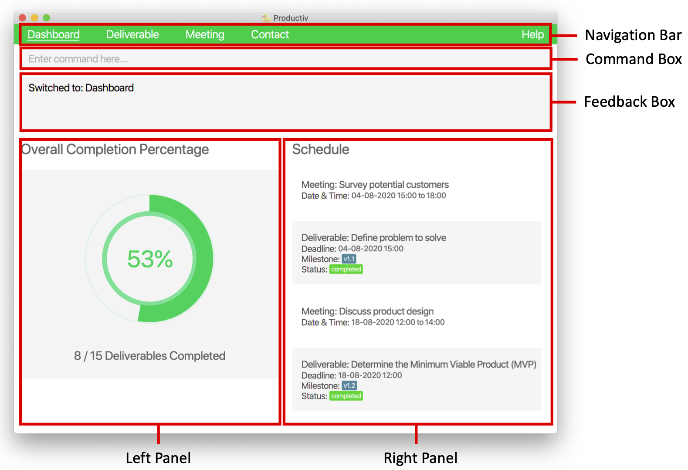
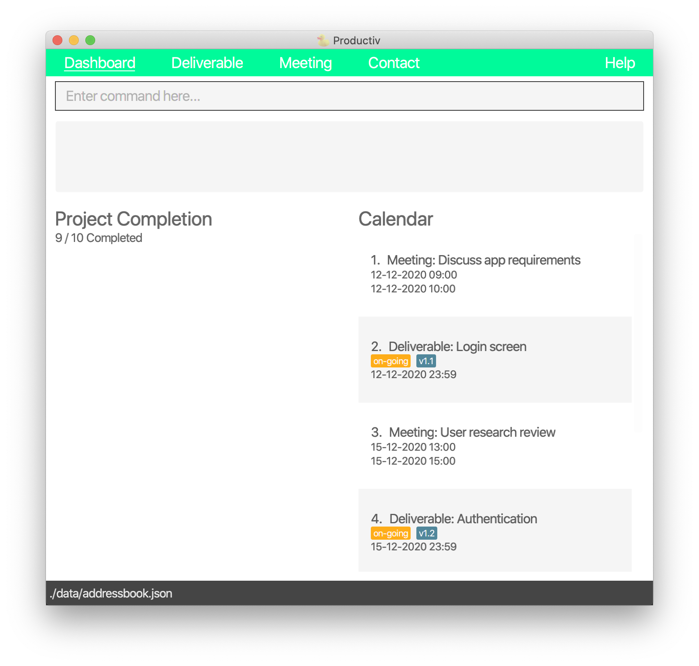
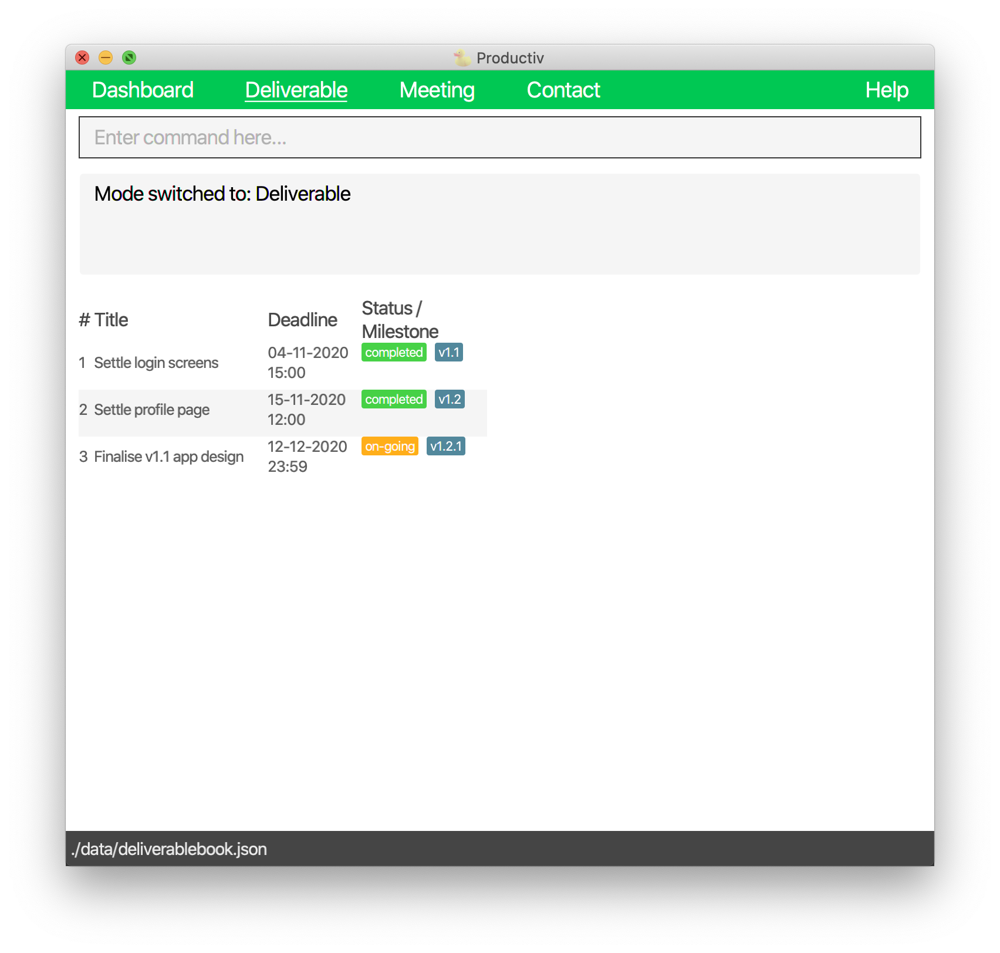
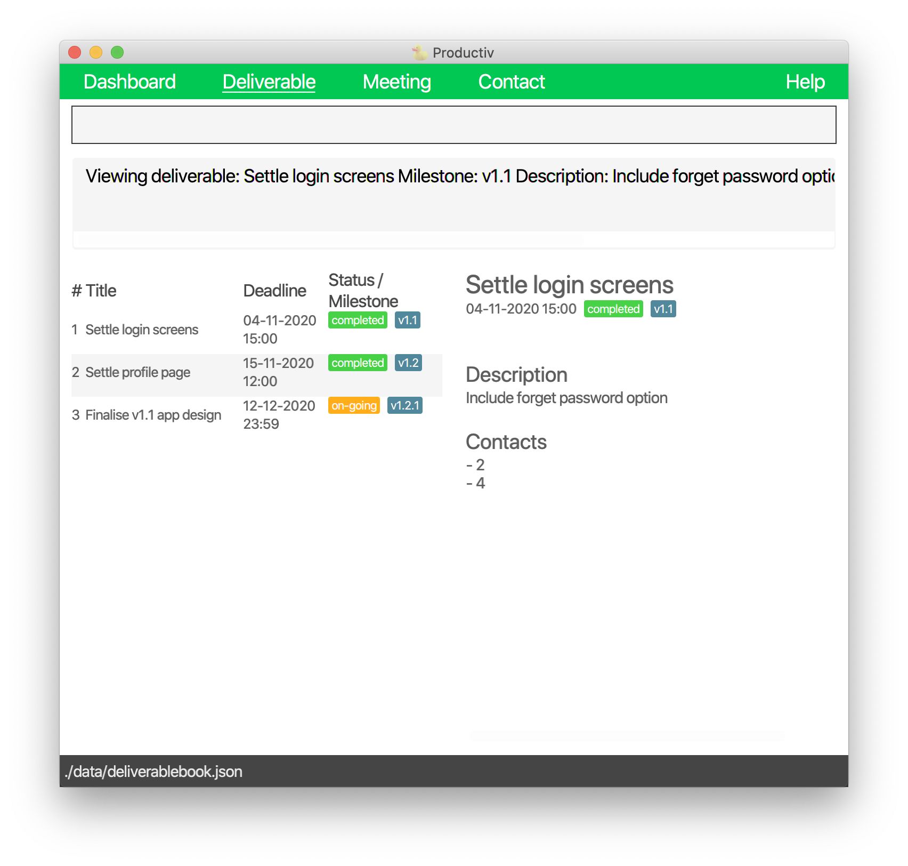
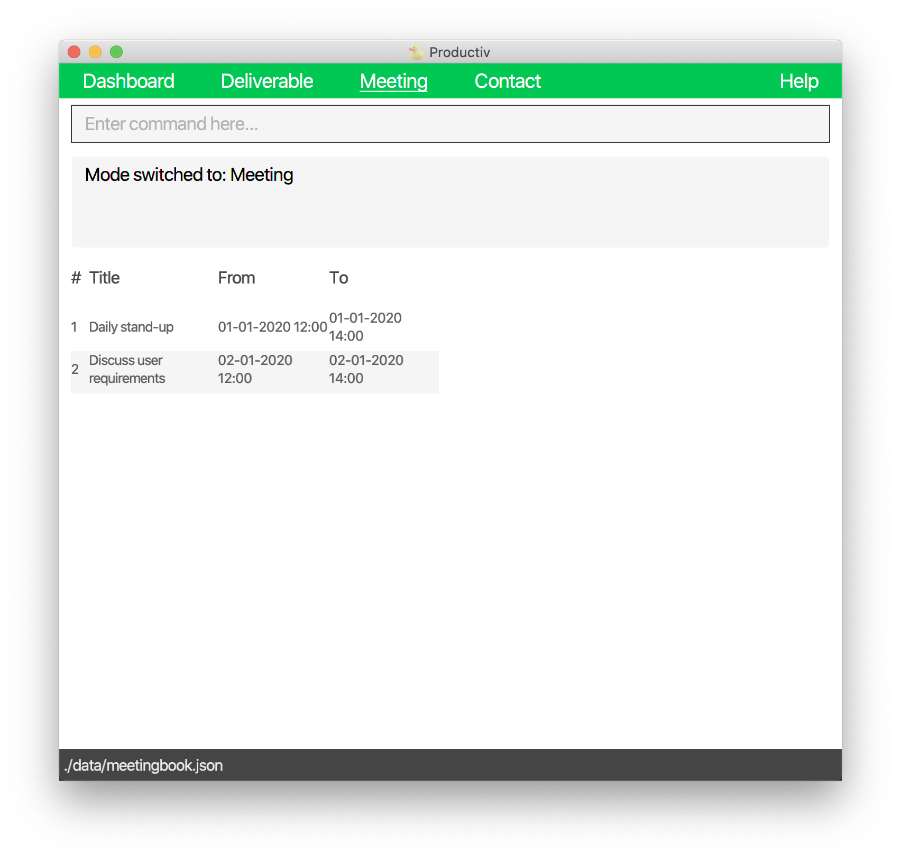
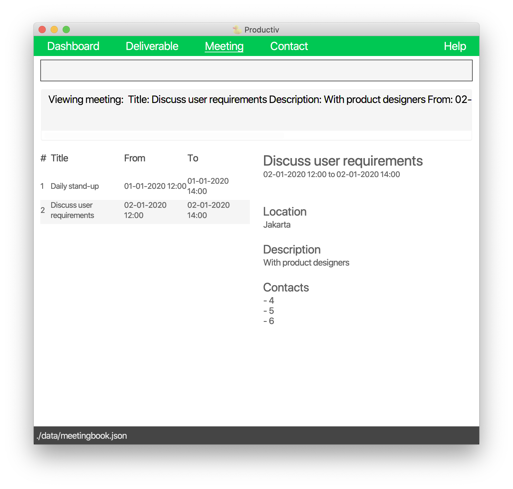
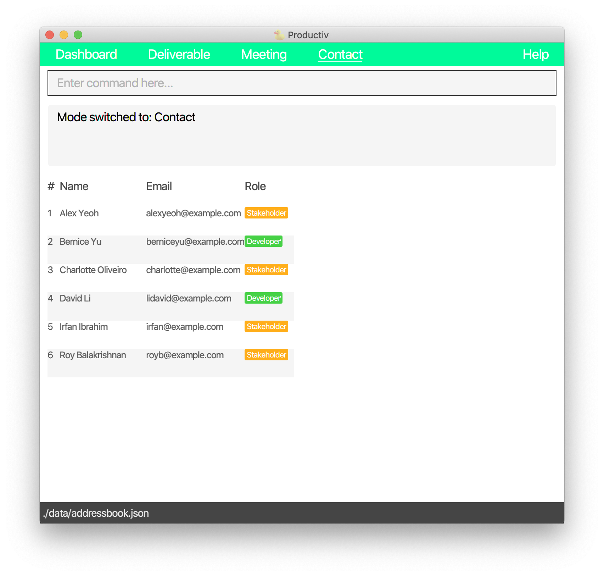
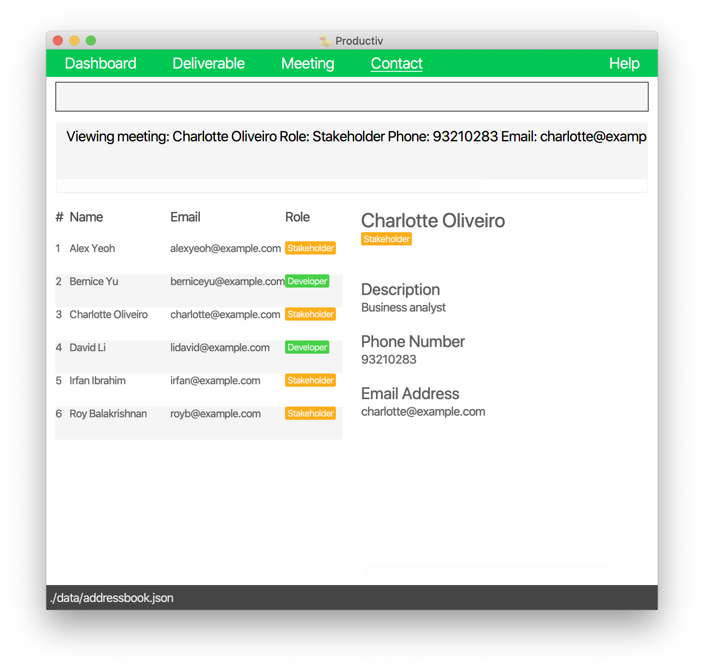

* Table of Contents
{:toc}

--------------------------------------------------------------------------------------------------------------------
## Introduction
### Overview
Productiv is a one-stop desktop app for product managers like yourself to organise your **deliverables**, 
**meetings** and **contacts** so that you can track your product's development easily.

Productiv is optimized for use via Command Line Interface (CLI). Thus, if you like to type and/or type fast, 
Productiv has just become better for you. Nevertheless, Productiv still has the benefits of a Graphical User Interface (GUI).

### Preview
To get you familiarised, the following is Productiv's GUI. 

   
   <figcaption>Dashboard</figcaption> 
   
   

   
   **:information_source: GUI components:** 
   
   1. **Navigation bar**: where you navigate to other modes.  
   1. **Command box**: where you enter your commands.  
   1. **Feedback box**: where you can see the feedback of your command.
        If your command is successful, you can see a success message.
        Otherwise, you can see an error message.  
   1. **Left panel**: where you can view  
      * your product's overall completion percentage (in dashboard mode), or     
      * your list of deliverables, meetings, or contacts (in deliverable, meeting, or contact mode)  
   1. **Right panel**: where you can view  
      * your product management schedule (in dashboard mode), or  
      * an expanded view of your selected deliverable, meeting, or contact (in deliverable, meeting, or contact mode)  
    
   Note: For modes other than the dashboard, you can see your file path at the bottom of your GUI. 
   

## Quick start

1. Ensure you have Java `11` installed in your computer (it should be your default Java version).

1. Download the latest `productiv.jar` from [here](https://github.com/AY2021S1-CS2103T-F11-2/tp/releases).

1. Copy the .jar file to an empty folder.

1. From your terminal, navigate to the folder containing the .jar file and enter `java -jar productiv.jar` to start Productiv.
Your dashboard should appear in a few seconds. 
Note that the app contains some sample data. 

   
   <figcaption>Dashboard</figcaption> 
   
1. Type a command in the command box and press Enter to execute it. 
Here is a sequence of example commands you can try: 

   1. `switch dv`: Switches to deliverable mode.

   1. `add t/Find profile page template by/11-12-2020 12:00 m/2.1.1`: Adds a deliverable with the 
   title `Find profile page template`, deadline `11-12-2020 12:00` and milestone `2.1.1`.

   1. `delete 1`: Deletes the 1st deliverable shown.

   1. `exit`: Exits the app.

1. Refer to [Features](#features) below for details of each available command.

--------------------------------------------------------------------------------------------------------------------

## Features

**:information_source: Notes about the command format:** 

* Words in upper case are the parameters to be supplied by you for their respective fields. 
  e.g. in `add n/NAME`, `NAME` is a parameter for the name field `n`, which can be used as `add n/Jason`. 
:bulb: **Tip:** If you are not sure what specific parameter to supply for any of the required fields, supply an estimate or random value as place holder. 

* Field-parameter pairs in square brackets are optional. 
  e.g `n/NAME [p/PHONE]` can be used as `n/Jason p/98890112` or as `n/Jason`.

* Field-parameter pairs can be in any order. 
  e.g. if the command specifies `n/NAME e/EMAIL`, `e/EMAIL n/NAME` is also acceptable.
  
* If multiple and/or repeat parameters are provided for the same field, only the last parameter will be accepted. 
  e.g. if you input the command `add r/dev n/NAME r/stk e/EMAIL r/stk`, it will be accepted as `add n/NAME r/stk e/EMAIL`.

* For single-word commands without fields, any word(s) following it will be ignored. 
  e.g. if you input the command `list everything please`, it will be accepted as `list`.

### General

#### Switching modes: `switch`

Switches to dashboard, deliverable, meeting or contact mode.

Format: `switch MODE`
* `MODE` can be `db` (dashboard), `dv` (deliverable), `m` (meeting) or `c` (contact).
* `switch` `dv`, `m` or `c` will display information related to your deliverables, meetings and contacts respectively,
e.g. `switch c` will display your contacts.
* `switch db` will display your project's completion status and your own schedule.
* How the commands will be executed depend on which mode you are currently in, e.g. `delete 1` in meeting mode deletes the 1st meeting shown.

Examples:
* `switch db` switches to dashboard mode.
* `switch m` switches to meeting mode.

#### Viewing help: `help`

Shows a message directing you to this User Guide.

Format: `help`

#### Exiting Productiv: `exit`

Exits the program.

Format: `exit`

#### Saving the data

Productiv automatically saves any changes that you made, to your computer's hard disk. 
Hence, you can focus on managing your product without fearing any unsaved changes.

### Dashboard

The [dashboard](#preview) gives you an overview of information related to your product.
The dashboard is the default landing page of Productiv.
Whenever you start up Productiv, you will be brought to dashboard mode.

The Overall Completion Percentage (OCP) will be displayed in the left panel. The OCP gives you a quick overview of the progress of your product’s development.

Your schedule will be displayed in the right panel. The schedule contains all your deliverables and meetings, chronologically sorted.

**:information_source: Note:** There are no commands specific to the Dashboard. 
You can only use commands found under [General](#general). 
  

### Deliverable

   
   <figcaption>Initial display of a deliverable list </figcaption>

**:information_source: Note:** You must be in the deliverable mode to execute the following commands. 
Refer to [switch](#switching-modes-switch) for more information.

#### Adding a deliverable: `add`

Adds a deliverable to your deliverable list.

Format: `add t/TITLE by/DEADLINE m/MILESTONE [c/CONTACTS] [d/DESCRIPTION]`
* `TITLE` is the main heading of the deliverable.
* `DEADLINE` is the due date time of the deliverable in dd-MM-yyyy HH:mm format.
* `DEADLINE` can be in the past but must not be earlier than the year 2019.
* `MILESTONE` is the milestone tagged to the deliverable.
* `MILESTONE` is a non-negative integer, or a period-separated string of non-negative integers, e.g. `2`, `14.2.1`.
* `CONTACTS` represents the contact(s) involved in seeing through the deliverable.
* `CONTACTS` is a name, or a comma-separated string of names, e.g. `conan`, `nancy, drew, paul`.
* `DESCRIPTION` contains additional information about the deliverable, e.g. sub-requirements. 

**:information_source: Notes:** 

* As `CONTACTS` is not related to your contact list, you can include those not present in it.

* You cannot add a deliverable with the same `TITLE` and `DEADLINE` as an existing deliverable.

* All newly-added deliverables will be assigned the `on-going` tag regardless of their deadline. You will
need to manually mark past deliverables as `completed`. Refer to 
[Marking a deliverable as completed](#marking-a-deliverable-as-completed-done) below for more details on 
the `done` command.
  

Examples:
* `add t/Login screen by/10-10-2020 18:00 m/1.1 c/Jordan Woods, Betsy Crowe d/Include email and password fields` 
adds a deliverable with the title `Login screen`, deadline `10-10-2020 18:00`, 
milestone `1.1`, contacts `Jordan Woods, Betsy Crowe` and description `Include email and password fields`.
* `add t/Find profile page template by/08-12-2020 12:00 m/2.1.1` 
adds a deliverable with the title `Find profile page template`, deadline `08-12-2020 12:00` and milestone `2.1.1`.

#### Editing a deliverable: `edit`

Edits an existing deliverable in your displayed deliverable list.

Format: `edit INDEX [t/TITLE] [by/DEADLINE] [m/MILESTONE] [c/CONTACTS] [d/DESCRIPTION] `
* `INDEX` is the index number of the deliverable in your displayed deliverable list.
* `INDEX` must be a positive integer.
* At least one of the fields of the deliverable must be changed.
* The existing values of the specified deliverable will be updated to the input values.
* You can clear an optional field by inputting an empty parameter, e.g. `edit 1 d/` will empty the description of the 1st deliverable.

**:information_source: Note:** You cannot edit a deliverable to have the same `TITLE` and `DEADLINE` as an existing deliverable.
  

Examples:
*  `edit 1 d/Must include username, email and password fields by/15-12-2020 12:00`
edits the description of the 1st deliverable to be `Must include username, email and password fields`
and its deadline to be `15-12-2020 12:00`.
*  `edit 2 c/` clears the optional contacts field of the 2nd deliverable.

#### Marking a deliverable as completed: `done`

Marks the specified deliverable from your displayed deliverable list as completed.

Format: `done INDEX`
* `INDEX` is the index number of the deliverable in your displayed deliverable list.
* `INDEX` must be a positive integer.

Example:
* `done 1` marks the 1st deliverable in your displayed deliverable list as completed.

#### Marking a deliverable as on-going: `undone`

Marks the specified deliverable from your displayed deliverable list as on-going.

Format: `undone INDEX`
* `INDEX` is the index number of the deliverable in your displayed deliverable list.
* `INDEX` must be a positive integer.

Example:
* `undone 1` marks the 1st deliverable in your displayed deliverable list as on-going.

#### Viewing a deliverable: `view`

Displays more details of the specified deliverable from your displayed deliverable list.

Format: `view INDEX`
* `INDEX` is the index number of the deliverable in your displayed deliverable list.
* `INDEX` must be a positive integer.

Example:
* `view 2` views the 2nd deliverable in your displayed deliverable list.

   
   <figcaption>Viewing a deliverable</figcaption> 

#### Finding deliverables: `find`

Finds the deliverables whose titles or descriptions contain any of the given keywords.

Format: `find KEYWORDS`
* `KEYWORDS` contains one or more keywords used to match deliverables.
* Searches only consider title and description.
* Searches are case-insensitive, e.g. `homepage` will match `Homepage`.
* Order of keywords does not matter, e.g. `Homepage Navigation` will match `Navigation Homepage`.
* Searches only account for full words, e.g. `Deploy` will not match `Deployment` but `Stand-up` will match `Up button` and `Laptop stand`. 
* Searches return deliverables matching at least one keyword, e.g. `Homepage Navigation` will return `Complete Homepage` and `Increase size of Navigation Bar`.

Examples:
* `find mock-up urgent` returns a deliverable with title `Finish mock-ups` and another with description `This is urgent and important!`.
* `find plan` returns a deliverable with title `Finalise design and plan` and another with description `Reminder to plan time wisely.`.

#### Listing all deliverables: `list`

Lists out all deliverables in your deliverable list, if any.

Format: `list`

:bulb:

**Tip:** Use this command when you want to list all your deliverables back after using the `find` command. 
Refer to [Finding deliverables](#finding-deliverables-find) above for details of the `find` command. 

#### Deleting a deliverable: `delete`

Deletes the specified deliverable from your deliverable list.

Format: `delete INDEX`
* `INDEX` is the index number of the deliverable in your displayed deliverable list.
* `INDEX` must be a positive integer.

Example:
* `delete 2` deletes the 2nd deliverable in your deliverable list.

#### Clearing all deliverables: `clear`

Clears all deliverables from your deliverable list, if any.

Format: `clear`

### Meeting

   
   <figcaption>Initial display of a meeting list </figcaption>
   

**:information_source: Note:** You must be in the meeting mode to execute the following commands. 
Refer to [switch](#switching-modes-switch) for more information.

   
 
#### Adding a meeting: `add`

Adds a meeting to your meeting list.

Format: `add t/TITLE from/FROM to/TO [c/CONTACTS] [l/LOCATION] [d/DESCRIPTION]`
* `TITLE` is the main heading of the meeting.
* `FROM` is the start date and time of the meeting in dd-MM-yyyy HH:mm format.
* `FROM` can accept dates in the past but must not be earlier than the year 2019.
* `TO` is the end time of the meeting in HH:mm format.
* `CONTACTS` represents the contact(s) involved in the meeting. 
* `CONTACTS` is a name, or a comma-separated string of names, e.g. `conan`, `nancy, drew, paul`.
* `LOCATION` is the location of the meeting.
* `DESCRIPTION` contains additional details about the meeting, e.g. agenda.

**:information_source: Notes:** 

* Different meetings may have overlapping timings as you may wish to send a representative for your clashing meetings.

* As `CONTACTS` is not related to your contact list, you can include those not present in it.

* You cannot add a meeting with the same `TITLE`, `FROM` and `TO` as an existing meeting.
  

Example:
* `add t/Discuss app requirements from/11-12-2020 09:00 to/10:00 c/Jordan Woods, Betsy Crowe d/Refine with business associates`
adds a meeting with the title `Discuss app requirements`, start date and time `11-12-2020 09:00`, 
end time `10:00`, contacts `Jordan Woods, Betsy Crowe` and description `Refine with business associates`.
* `add t/User research review from/15-12-2020 13:00 to/15:00 l/Meeting room A` 
adds a meeting with the title `User research review`, start date and time `15-12-2020 13:00`, 
end time `15:00` and location `Meeting room A`.

#### Editing a meeting: `edit`

Edits an existing meeting in your displayed meeting list.

Format: `edit INDEX [t/TITLE] [from/FROM] [to/TO] [c/CONTACTS] [l/LOCATION] [d/DESCRIPTION]`
* `INDEX` is the index number of the meeting in your displayed meeting list.
* `INDEX` must be a positive integer.
* At least one of the fields of the meeting must be changed.
* The existing values of the specified meeting will be updated to the input values.
* You can clear an optional field by inputting an empty parameter, e.g. `edit 1 d/` will empty the description of the 1st meeting.

**:information_source: Note:** You cannot edit a meeting to have the same `TITLE`, `FROM` and `TO` as an existing meeting.
  

Examples:
* `edit 2 t/Discuss final release features d/Finalise dashboard functions`
edits the title of the 2nd meeting to be `Discuss final release features` 
and its description to be `Finalise dashboard functions`.
* `edit 4 c/` clears the optional contact field of the 4th meeting.

#### Viewing a meeting: `view`

Displays more details of the specified meeting from your displayed meeting list.

Format: `view INDEX`
* `INDEX` is the index number of the meeting in your displayed meeting list.
* `INDEX` must be a positive integer.

Example:
* `view 2` views the 2nd meeting in your meeting list.

   
   <figcaption>Viewing a meeting</figcaption> 

#### Finding meetings: `find`

Finds the meetings whose titles or descriptions contain any of the given keywords.

Format: `find KEYWORDS`
* `KEYWORDS` contains one or more keywords used to match meetings.
* Searches only consider title and description.
* Searches are case-insensitive, e.g. `version` will match `Version`.
* Order of keywords does not matter, e.g. `v1.2 mid` will match `mid v1.2`.
* Searches only account for full words, e.g. `Meeting` will not match `Meetings`.
* Searches return meetings matching at least one keyword, e.g. `Complete game` will return `Complete features` and `Final game`.

Examples:
* `find Survey` returns a meeting with title `Survey potential customers` and another with description `Don't forget to present survey results.`.
* `find consult goals` returns a meeting with title `Consult about marketing goals` and another with description `Goals must be achieved!`.

#### Listing all meetings: `list`

Lists out all meetings in your meeting list, if any.

Format: `list`

:bulb:

**Tip:** Use this command when you want to list all your meetings back after using the `find` command. 
Refer to [Finding meetings](#finding-meetings-find) above for details of the `find` command. 

#### Deleting a meeting: `delete`

Deletes the specified meeting from your displayed meeting list.

Format: `delete INDEX`
* `INDEX` is the index number of the meeting in your displayed meeting list.
* `INDEX` must be a positive integer.

Example:
* `delete 3` deletes the 3rd meeting in your displayed meeting list.

#### Clearing all meetings: `clear`

Clears all meetings from your meeting list, if any.

Format: `clear` 

### Contact

   
   <figcaption>Initial display of a contact list </figcaption>
   

**:information_source: Note:** You must be in the contact mode to execute the following commands. 
Refer to [switch](#switching-modes-switch) for more information.

 

#### Adding a contact: `add`

Adds a developer or stakeholder to your contact list.

Format: `add n/NAME r/ROLE e/EMAIL [p/PHONE] [d/DESCRIPTION]`
* `NAME` is the name of the contact. 
* `NAME` should only take alphabetic characters and (optionally) spaces.
* `ROLE` is the type of contact, either `dev` (developer) or `stk` (stakeholder).
* `EMAIL` is the email address of the contact.
* `PHONE` is the phone number of the contact.
* `PHONE` should only contain numbers, and must be at least 3-digits long.
* `DESCRIPTION` contains additional information about the contact, such as their job position.

**:information_source: Note:** You cannot add a contact with the same `NAME` and `EMAIL` as an existing contact.
  

:bulb:

**Tip:** Leave out the + sign for `PHONE`s with country codes.

Examples:
* `add n/Jordan Woods r/dev e/jordanwoods@glutter.com p/81234567`
adds a developer with the name `Jordan Woods`, email `jordanwoods@glutter.com` and phone number `81234567`.
* `add n/Betsy Crowe r/stk e/betsybet872@pmail.com`
adds a stakeholder with the name `Betsy Crowe` and email `betsybet872@pmail.com`.

#### Editing a contact: `edit`

Edits an existing contact in your displayed contact list.

Format: `edit INDEX [n/NAME] [r/ROLE] [e/EMAIL] [p/PHONE] [d/DESCRIPTION]`
* `INDEX` is the index number of the contact in your displayed contact list.
* `INDEX` must be a positive integer.
* At least one of the fields of the contact must be changed.
* The existing values of the specified contact will be updated to the input values.
* You can clear an optional field by inputting an empty parameter, e.g. `edit 1 d/` will empty the description of the 1st contact.

**:information_source: Note:** You cannot edit a contact to have the same `NAME` and `EMAIL` as an existing contact.
  

Examples:
*  `edit 1 e/jeremysand@glutter.com p/81234567`
edits the email and phone number of the 1st contact to be `jeremysand@glutter.com` and `81234567` respectively.
*  `edit 2 p/` 
clears the optional phone field of the 2nd contact.

#### Viewing a contact: `view`

Displays more details of the specified contact from your displayed contact list.

Format: `view INDEX`
* `INDEX` is the index number of the contact in your displayed contact list.
* `INDEX` must be a positive integer.

Example:
* `view 2` views the 2nd contact in your contact list.

   
   <figcaption>Viewing a contact</figcaption> 

#### Finding contacts: `find`

Finds the contacts whose names or descriptions contain any of the given keywords.

Format: `find KEYWORDS`
* `KEYWORDS` contains one or more keywords used to match contacts.
* Searches only consider name and description.
* Searches are case-insensitive, e.g. `hans` will match `Hans`.
* Order of keywords does not matter, e.g. `Hans Bo` will match `Bo Hans`.
* Searches only account for full words, e.g. `Han` will not match `Hans`.
* Searches return contacts matching at least one keyword, e.g. `Hans Bo` will return `Hans Seed` and `Bo Yarns`.

Examples:
* `find alex yeoh` returns a contact with name `Alex Yeoh` and another with description `Business analyst. Alex works with him.`.
* `find Johnson` returns a contact with name `Amber Johnson` and another with description `Works at Johnson & Johnson`.

#### Listing all contacts: `list`

Lists out all contacts from your contact list, if any.

Format: `list`

:bulb:

**Tip:** Use this command when you want to list all your contacts back after using the `find` command. 
Refer to [Finding contacts](#finding-contacts-find) above for details of the `find` command. 

#### Deleting a contact: `delete`

Deletes the specified contact from your displayed contact list.

Format: `delete INDEX`
* `INDEX` is the index number of the contact in your displayed contact list.
* `INDEX` must be a positive integer.

Example:
* `delete 3` deletes the 3rd contact in the displayed contact list.

#### Clearing all contacts: `clear`

Clears all contacts from your contact list, if any.

Format: `clear`

--------------------------------------------------------------------------------------------------------------------

## FAQ

**Q**: How do I start using Productiv? 
**A**: You can refer to our [Quick Start Guide](#quick-start).

**Q**: Which operating systems can I run Productiv on? 
**A**: Currently, Productiv is supported on both Windows and Mac. Just ensure
that you have Java `11` installed on your computer and it is your default Java version.

---------------------------------------------------------------------------------------------------------------------

## Command summary

### General 

Action         | Format, Examples
-------------- |--------------------------------------------------------------------------------------------------
**Switch**     | `switch MODE`   e.g. `switch dv`
**Help**       | `help`
**Exit**       | `exit`

### Deliverable

Action         | Format, Examples
---------------|------------------------
Add            | `add t/TITLE by/DEADLINE m/MILESTONE [c/CONTACTS] [d/DESCRIPTION]`   e.g. `add t/Login screen by/10-10-2020 18:00 m/1.1 c/Jordan Woods, Betsy Crowe d/Include email and password fields` 
Edit           | `edit INDEX [t/TITLE] [by/DEADLINE] [m/MILESTONE] [c/CONTACTS] [d/DESCRIPTION]`   e.g. `edit 1 by/14-12-2020 12:00 d/Must include username, email and password fields`
Mark as completed   | `done INDEX`   e.g. `done 3`
Mark as on-going    | `undone INDEX`   e.g. `undone 1`
View           | `view INDEX`   e.g. `view 2`
Find           | `find KEYWORDS`   e.g. `find Homepage urgent`
List           | `list` 
Delete         | `delete INDEX`   e.g. `delete 3`
Clear          | `clear`

### Meeting

Action         | Format, Examples
---------------|------------------------
Add            | `add t/TITLE from/FROM to/TO [c/CONTACTS] [l/LOCATION] [d/DESCRIPTION]`   e.g. `add t/Discuss app requirements from/11-12-2020 09:00 to/10:00 c/Jordan Woods, Betsy Crowe l/Meeting Room A d/Refine with business associates`
Edit           | `edit INDEX [t/TITLE] [from/FROM] [to/TO] [c/CONTACTS] [l/LOCATION] [d/DESCRIPTION]`   e.g. `edit 2 t/Discuss final release features d/Finalise dashboard functions`
View           | `view INDEX`   e.g. `view 2`
Find           | `find KEYWORDS`   e.g. `find discuss user guide John`
List           | `list` 
Delete         | `delete INDEX`   e.g. `delete 3`
Clear          | `clear`

### Contact

Action         | Format, Examples
---------------|------------------------
Add            | `add n/NAME r/ROLE e/EMAIL [p/PHONE] [d/DESCRIPTION]`   e.g. `add n/Johnny r/stk e/johnny@example.com p/12345678 d/Business Analyst`
Edit           | `edit INDEX [n/NAME] [r/ROLE] [e/EMAIL] [p/PHONE] [d/DESCRIPTION]`   e.g. `edit 1 n/John r/dev e/john@email.com`
View           | `view INDEX`   e.g. `view 2`
Find           | `find KEYWORDS`   e.g. `find John Kite`
List           | `list` 
Delete         | `delete INDEX`   e.g. `delete 3`
Clear          | `clear`

---------------------------------------------------------------------------------------------------------------------

## Glossary

\# |            Term                | Description
---|--------------------------------|------------------------------------------------------------------------------------------------|
1  | Command Line Interface (CLI)   | A text-based user interface (UI) used to view and manage computer files.                       |
2  | Graphical User Interface (GUI) | A system of interactive visual components for computer software.                               |
3  | Deliverable                    | An item to be completed as part of the product development process.                            |
4  | Milestone                      | A stage in the software development process associated with a particular group of deliverables.|
5  | Mode                           | The state of the application that affects how each command will be executed. The app can be in dashboard, deliverable, meeting or contact mode.                                                  |
6  | Stakeholder                    | An external party involved with the product.                                                   |
