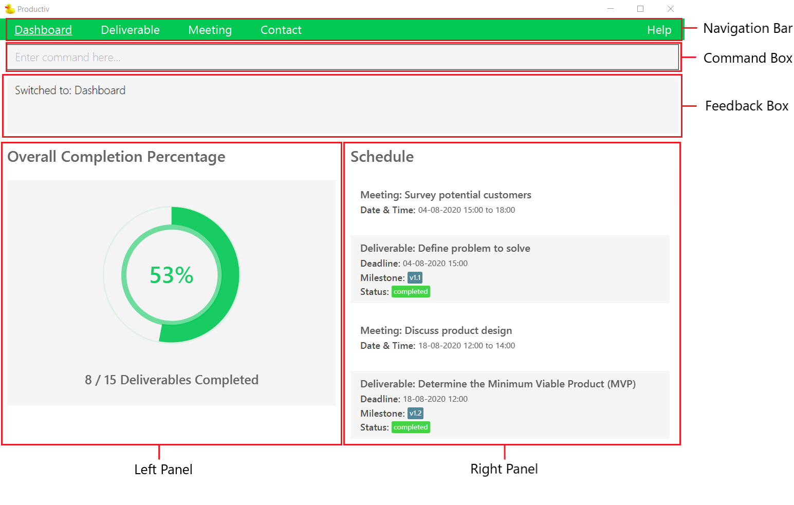

## Table of Contents

1. [Introduction](#1-introduction)
    - [1.1 Overview](#11-overview)
    - [1.2 Preview](#12-preview)
2. [Quick start](#2-quick-start)
3. [Features](#3-features)
    - [3.1 General](#31-general)
        * [3.1.1 Switching modes: `switch`](#311-switching-modes---switch-)
        * [3.1.2 Viewing help: `help`](#312-viewing-help---help-)
        * [3.1.3 Exiting Productiv: `exit`](#313-exiting-productiv---exit-)
        * [3.1.4 Saving the data](#314-saving-the-data)
    - [3.2 Dashboard](#32-dashboard)
    - [3.3 Deliverable](#33-deliverable)
        * [3.3.1 Adding a deliverable: `add`](#331-adding-a-deliverable---add-)
        * [3.3.2 Editing a deliverable: `edit`](#332-editing-a-deliverable---edit-)
        * [3.3.3 Marking a deliverable as completed: `done`](#333-marking-a-deliverable-as-completed---done-)
        * [3.3.4 Marking a deliverable as on-going: `undone`](#334-marking-a-deliverable-as-on-going---undone-)
        * [3.3.5 Viewing a deliverable: `view`](#335-viewing-a-deliverable---view-)
        * [3.3.6 Finding deliverables: `find`](#336-finding-deliverables---find-)
        * [3.3.7 Listing all deliverables: `list`](#337-listing-all-deliverables---list-)
        * [3.3.8 Deleting a deliverable: `delete`](#338-deleting-a-deliverable---delete-)
        * [3.3.9 Clearing all deliverables: `clear`](#339-clearing-all-deliverables---clear-)
    - [3.4 Meeting](#34-meeting)
        * [3.4.1 Adding a meeting: `add`](#341-adding-a-meeting---add-)
        * [3.4.2 Editing a meeting: `edit`](#342-editing-a-meeting---edit-)
        * [3.4.3 Viewing a meeting: `view`](#343-viewing-a-meeting---view-)
        * [3.4.4 Finding meetings: `find`](#344-finding-meetings---find-)
        * [3.4.5 Listing all meetings: `list`](#345-listing-all-meetings---list-)
        * [3.4.6 Deleting a meeting: `delete`](#346-deleting-a-meeting---delete-)
        * [3.4.7 Clearing all meetings: `clear`](#347-clearing-all-meetings---clear-)
    - [3.5 Contact](#35-contact)
        * [3.5.1 Adding a contact: `add`](#351-adding-a-contact---add-)
        * [3.5.2 Editing a contact: `edit`](#352-editing-a-contact---edit-)
        * [3.5.3 Viewing a contact: `view`](#353-viewing-a-contact---view-)
        * [3.5.4 Finding contacts: `find`](#354-finding-contacts---find-)
        * [3.5.5 Listing all contacts: `list`](#355-listing-all-contacts---list-)
        * [3.5.6 Deleting a contact: `delete`](#356-deleting-a-contact---delete-)
        * [3.5.7 Clearing all contacts: `clear`](#357-clearing-all-contacts---clear-)

4. [FAQ](#4-faq)
5. [Command summary](#5command-summary)
    - [5.1 General](#51-general)
    - [5.2 Deliverable](#52-deliverable)
    - [5.3 Meeting](#53-meeting)
    - [5.4 Contact](#54-contact)
6. [Glossary](#6-glossary)

--------------------------------------------------------------------------------------------------------------------
## 1. Introduction
### 1.1 Overview
Productiv is a one-stop desktop app for product managers like yourself to organise your **deliverables**, 
**meetings** and **contacts** so that you can track your product's development easily.

Productiv is optimized for use via Command Line Interface (CLI). Thus, if you like to type and/or type fast, 
Productiv has just become better for you. Nevertheless, Productiv still has the benefits of a Graphical User Interface (GUI).

### 1.2 Preview
To get you familiarised, see the following for Productiv's GUI. 
   

  

<i>Figure 1: Dashboard components</i>
  

   

   
   **:information_source: GUI components:** 
   
   1. **Navigation bar**: where you navigate to other modes.  
   1. **Command box**: where you enter your commands.  
   1. **Feedback box**: where you can see the feedback of your command.
        If your command is successful, you can see a success message.
        Otherwise, you can see an error message.  
   1. **Left panel**: where you can view  
      * your product's overall completion percentage (in dashboard mode), or     
      * your list of deliverables, meetings, or contacts (in deliverable, meeting, or contact mode)  
   1. **Right panel**: where you can view  
      * your product management schedule (in dashboard mode), or  
      * an expanded view of your selected deliverable, meeting, or contact (in deliverable, meeting, or contact mode)  

   

   
   Note: For modes other than the dashboard, you can see your file path at the bottom of your GUI. 
   

## 2. Quick start

1. Ensure you have Java `11` installed in your computer (it should be your default Java version).

1. Download the latest `productiv.jar` from [here](https://github.com/AY2021S1-CS2103T-F11-2/tp/releases).

1. Copy the .jar file to an empty folder.

1. From your terminal, navigate to the folder containing the .jar file and enter `java -jar productiv.jar` to start Productiv.
Your dashboard should appear in a few seconds. 
Note that the app contains some sample data. 

<i>Figure 2: Dashboard</i>
   

1. Type a command in the command box and press Enter to execute it. 
Here is a sequence of example commands you can try: 

   1. `switch dv`: Switches to deliverable mode.

   1. `add t/Find profile page template by/11-12-2020 12:00 m/2.1.1`: Adds a deliverable with the 
   title `Find profile page template`, deadline `11-12-2020 12:00` and milestone `2.1.1`.

   1. `delete 1`: Deletes the 1st deliverable shown.

   1. `exit`: Exits the app.

1. Refer to [Features](#3-features) below for details of each available command.

--------------------------------------------------------------------------------------------------------------------
## 3. Features

Excited about what Productiv can do for you? Here are the 4 main features of Productiv!
1. [Dashboard](#dashboard) - Gives you an overview of your product’s development and upcoming events so that you can work better towards production deadlines.
1. [Deliverable](#deliverable) - Helps you track your product’s deliverables so that you can work better towards meeting them.
1. [Meeting](#meeting) - Helps you manage your product-related meetings	so that you can be clear on your meeting schedule.
1. [Contact](#contact) - Helps you organise your developer or stakeholder contacts so that you can reference them easily.

**Listed below are the common components of a command:** 

Component | Description |
---------------------|------------|
Command word | The first word of a command. It is the action that you want to perform. |
Prefix | The characters before the parameter. It is the short-form of the corresponding field. |
Parameter |	The words following each prefix. It represents the value of the corresponding field. |

For example, here's the breakdown of the command `add t/TITLE by/DEADLINE m/MILESTONE [c/CONTACTS] [d/DESCRIPTION]`:
* Command word - `add`
* Prefixes - `t/`, `by/`, `m/`, `c/`, `d/`
* Parameters - `TITLE`, `DEADLINE`, `MILESTONE`, `CONTACTS`, `DESCRIPTION`

**:information_source: Note:** Prefix-parameter pairs in square brackets are optional, i.e. `[c/CONTACTS]` and `[d/DESCRIPTION]` need not be present in the command.

### 3.1 General

#### 3.1.1 Switching modes: `switch`

Switches to dashboard, deliverable, meeting or contact mode.

Format: `switch MODE`

Parameter      | Description                  | Examples
---------------|------------------------------| --------------------------------
`MODE`         | The mode that you wish to navigate to.    It can be only be one of the following:   &emsp;&bull; Dashboard  &emsp;&bull; Deliverable  &emsp;&bull; Meeting  &emsp;&bull; Contact | The following are the only valid inputs: &emsp;&bull;`db` (Dashboard)  &emsp;&bull;`dv` (Deliverable)  &emsp;&bull;`m` (Meeting)  &emsp;&bull;`c` (Contact)

**:information_source: Note:** How the commands will be executed depend on which mode you are currently in, 
e.g. `delete 1` in meeting mode deletes the 1st meeting shown.). 

#### 3.1.2 Viewing help: `help`

Shows a message directing you to this User Guide.

   

<i>Figure 3: Help</i>
   

Format: `help`

#### 3.1.3 Exiting Productiv: `exit`

Exits the program.

Format: `exit`

#### 3.1.4 Saving the data

Productiv automatically saves any changes that you made, to your computer's hard disk. 
Hence, you can focus on managing your product without fearing any unsaved changes.

### 3.2 Dashboard

The dashboard gives you an overview of information related to your product.
The dashboard is the default landing page of Productiv.
Whenever you start up Productiv, you will be brought to dashboard mode.

The Overall Completion Percentage (OCP) will be displayed in the left panel. The OCP gives you a quick overview of the progress of your product’s development.

Your schedule will be displayed in the right panel. The schedule contains all your deliverables and meetings, chronologically sorted.

**:information_source: Note:** There are no commands specific to the dashboard. 
You can only use commands found under [General](#31-general). 
  

### 3.3 Deliverable
   

  

<i>Figure 4: Initial display of a deliverable list</i>
  

**:information_source: Note:** You must be in the deliverable mode to execute the following commands. 
Refer to [switch](#311-switching-modes---switch-) for more information.

#### 3.3.1 Adding a deliverable: `add`

Adds a deliverable to your deliverable list.

Format: `add t/TITLE by/DEADLINE m/MILESTONE [c/CONTACTS] [d/DESCRIPTION]`

Parameter      | Description                   | Example(s)
---------------|-------------------------------|--------------------------------
`TITLE`        | The main heading of your deliverable.| `Create login screen`
`DEADLINE`     | The due date time of your deliverable.  Details: &emsp;&bull; It must not be earlier than the year 2019. &emsp;&bull; It is in dd-MM-yyyy HH:mm format.| `30-12-2020 18:00`
`MILESTONE`    | The milestone tagged to your deliverable.  Detail: It is a non-negative integer, or a period-separated string of non-negative integers. |  &bull;`2` &bull;`14.2.1`
`CONTACTS`     | The contact(s) involved in seeing through your deliverable.  Detail:  It is a name, or a comma-separated string of names. |  &bull;`conan` &bull;`Zachary, drew, Paul Smith`
`DESCRIPTION`  | Any additional information about your deliverable.|`Remember to include email and password fields`

**:warning: Warning:** 

* You cannot add a deliverable with the same `TITLE` and `DEADLINE` as an existing deliverable.

**:information_source: Note:** The dashboard’s OCP and Schedule will be updated accordingly.

Examples:
* `add t/Login screen by/10-10-2020 18:00 m/1.1 c/Jordan Woods, Betsy Crowe d/Include email and password fields` 
adds a deliverable with the title `Login screen`, deadline `10-10-2020 18:00`, 
milestone `1.1`, contacts `Jordan Woods, Betsy Crowe` and description `Include email and password fields`.
* `add t/Find profile page template by/08-12-2020 12:00 m/2.1.1` 
adds a deliverable with the title `Find profile page template`, deadline `08-12-2020 12:00` and milestone `2.1.1`.

#### 3.3.2 Editing a deliverable: `edit`

Edits an existing deliverable in your displayed deliverable list.

Format: `edit INDEX [t/TITLE] [by/DEADLINE] [m/MILESTONE] [c/CONTACTS] [d/DESCRIPTION] `

Parameter      | Description                   | Example 
---------------|-------------------------------|--------------------------------
`INDEX`        | The index number of the deliverable you wish to edit in your displayed deliverable list.   Detail: It must be a positive integer. |`1`: Represents the 1st deliverable in your list

**:information_source: Notes:**

* At least one of the fields of the deliverable must be changed.
* You can clear an optional field by inputting an empty parameter, e.g. `edit 1 d/` will empty the description of the 1st deliverable.
* The dashboard’s Schedule will be updated accordingly.

Examples:
*  `edit 1 d/Must include username, email and password fields by/15-12-2020 12:00`
edits the description of the 1st deliverable to be `Must include username, email and password fields`
and its deadline to be `15-12-2020 12:00`.
*  `edit 2 c/` clears the optional contacts field of the 2nd deliverable.

**:warning: Warning:** You cannot edit a deliverable to have the same `TITLE` and `DEADLINE` as an existing deliverable.
  

#### 3.3.3 Marking a deliverable as completed: `done`

Marks the specified deliverable from your displayed deliverable list as completed.

Format: `done INDEX`

Parameter      | Description                   | Example 
---------------|-------------------------------|--------------------------------
`INDEX`        | The index number of the deliverable you wish to mark as completed in your displayed deliverable list.   Detail:  It must be a positive integer. |`2`: Represents the 2nd deliverable in your list

**:information_source: Note:** The dashboard’s OCP and Schedule will be updated accordingly.

Example:
* `done 1` marks the 1st deliverable in your displayed deliverable list as completed.

#### 3.3.4 Marking a deliverable as on-going: `undone`

Marks the specified deliverable from your displayed deliverable list as on-going.

Format: `undone INDEX`

Parameter      | Description                   | Example 
---------------|-------------------------------|--------------------------------
`INDEX`        | The index number of the deliverable you wish to mark as on-going in your displayed deliverable list.   Detail: It must be a positive integer. |`2`: Represents the 2nd deliverable in your list

**:information_source: Note:** The dashboard’s OCP and Schedule will be updated accordingly.

Example:
* `undone 1` marks the 1st deliverable in your displayed deliverable list as on-going.

#### 3.3.5 Viewing a deliverable: `view`

Displays more details of the specified deliverable from your displayed deliverable list.

Format: `view INDEX`

Parameter      | Description                   | Example 
---------------|-------------------------------|--------------------------------
`INDEX`        | The index number of the deliverable you wish to view in your displayed deliverable list.   Detail: It must be a positive integer. |`2`: Represents the 2nd deliverable in your list

Example:
* `view 2` views the 2nd deliverable in your displayed deliverable list.
   

 

<i>Figure 5: Viewing a deliverable</i>
 

   
#### 3.3.6 Finding deliverables: `find`

Finds the deliverables whose titles or descriptions contain any of the given keywords.

Format: `find KEYWORDS`

Parameter      | Description                   | Example 
---------------|-------------------------------|--------------------------------
`KEYWORDS`     | One or more keywords used to search for the deliverables you need.   Details: &emsp;&bull; Searches based on title and description. &emsp;&bull; Searches are case-insensitive,  &emsp;&nbsp;e.g. `homepage` will match `Homepage`.| `Homepage Navigation`: Will match phrases such as `Complete homepage` and `Increase size of Navigation Bar`

:bulb:

**Tip:** Use the `list` command when you want to list all your deliverables back after using the `find` command.
Refer to [Listing all deliverables](#listing-all-deliverables-list) below for details of the `list` command.

Examples:
* `find mock-up urgent` returns a deliverable with title `Finish mock-ups` and another with description `This is urgent and important!`.
* `find plan` returns a deliverable with title `Finalise design and plan` and another with description `Reminder to plan time wisely.`.

#### 3.3.7 Listing all deliverables: `list`

Lists out all deliverables in your deliverable list, if any.

Format: `list`

#### 3.3.8 Deleting a deliverable: `delete`

Deletes the specified deliverable from your deliverable list.

Format: `delete INDEX`

Parameter      | Description                   | Example 
---------------|-------------------------------|--------------------------------
`INDEX`     | The index number of the deliverable you wish to delete in your displayed deliverable list.   Detail: It must be a positive integer. | `2`: Represents the 2nd deliverable in your list

**:information_source: Note:** The dashboard’s OCP and Schedule will be updated accordingly.

Example:
* `delete 2` deletes the 2nd deliverable in your deliverable list.

#### 3.3.9 Clearing all deliverables: `clear`

Clears all deliverables from your deliverable list, if any.

Format: `clear`

**:information_source: Note:** The dashboard’s OCP and Schedule will be updated accordingly.

### 3.4 Meeting

 

<i>Figure 6: Initial display of a meeting list</i>
 

   

**:information_source: Note:** You must be in the meeting mode to execute the following commands. 
Refer to [switch](#311-switching-modes---switch-) for more information.

   
 
#### 3.4.1 Adding a meeting: `add`

Adds a meeting to your meeting list.

Format: `add t/TITLE from/FROM to/TO [c/CONTACTS] [l/LOCATION] [d/DESCRIPTION]`

Parameter      | Description                   | Example(s) 
---------------|-------------------------------|--------------------------------
`TITLE`        | The main heading of your meeting.| `Daily stand-up meeting`
`FROM`         | The start date and time of your meeting.  Details: &emsp;&bull; It must not be earlier than the year 2019. &emsp;&bull; It is in dd-MM-yyyy HH:mm format.| `30-12-2020 18:00` |
`TO`           | The end time of your meeting.  Detail: It is in HH:mm format. |`20:OO`
`CONTACTS`     | The contact(s) involved in your meeting.  Detail:  It is a name, or a comma-separated string of names. |  &bull;`Louisa Kennedy` &bull;`Nancy, Abraham, Sarah`
`LOCATION`     | The location of your meeting. | `Meeting room 1B`
`DESCRIPTION`  | Any additional information about your meeting.|`Remember to plan the agenda before the meeting`

**:warning: Warning:** 

* You cannot add a meeting with the same `TITLE`, `FROM` and `TO` as an existing meeting.
  

**:information_source: Note:** The dashboard’s Schedule will be updated accordingly.

Example:
* `add t/Discuss app requirements from/11-12-2020 09:00 to/10:00 c/Jordan Woods, Betsy Crowe d/Refine with business associates`
adds a meeting with the title `Discuss app requirements`, start date and time `11-12-2020 09:00`, 
end time `10:00`, contacts `Jordan Woods, Betsy Crowe` and description `Refine with business associates`.
* `add t/User research review from/15-12-2020 13:00 to/15:00 l/Meeting room A` 
adds a meeting with the title `User research review`, start date and time `15-12-2020 13:00`, 
end time `15:00` and location `Meeting room A`.

#### 3.4.2 Editing a meeting: `edit`

Edits an existing meeting in your displayed meeting list.

Format: `edit INDEX [t/TITLE] [from/FROM] [to/TO] [c/CONTACTS] [l/LOCATION] [d/DESCRIPTION]`

Parameter      | Description                   | Example 
---------------|-------------------------------|--------------------------------
`INDEX`        | The index number of the meeting you wish to edit in your displayed meeting list.   Detail: It must be a positive integer. |`1`: Represents the 1st meeting in your list

**:warning: Warning:** You cannot edit a meeting to have the same `TITLE`, `FROM` and `TO` as an existing meeting.

**:information_source: Note:**

* At least one of the fields of your meeting must be changed.
* You can clear an optional field by inputting an empty parameter, e.g. `edit 1 d/` will empty the description of your 1st meeting.
* The dashboard’s Schedule will be updated accordingly.

Examples:
* `edit 2 t/Discuss final release features d/Finalise dashboard functions`
edits the title of the 2nd meeting to be `Discuss final release features` 
and its description to be `Finalise dashboard functions`.
* `edit 4 c/` clears the optional contact field of the 4th meeting.

**:warning: Warning:** You cannot edit a meeting to have the same `TITLE`, `FROM` and `TO` as an existing meeting.
  

#### 3.4.3 Viewing a meeting: `view`

Displays more details of the specified meeting from your displayed meeting list.

Format: `view INDEX`

Parameter      | Description                   | Example 
---------------|-------------------------------|--------------------------------
`INDEX`        | The index number of the meeting you wish to view in your displayed meeting list.   Detail: It must be a positive integer. |`2`: Represents the 2nd meeting in your list

Example:
* `view 2` views the 2nd meeting in your meeting list.
   

 

<i>Figure 7: Viewing a meeting</i>
 

#### 3.4.4 Finding meetings: `find`

Finds the meetings whose titles or descriptions contain any of the given keywords.

Format: `find KEYWORDS`

Parameter      | Description                   | Example 
---------------|-------------------------------|--------------------------------
`KEYWORDS`     | One or more keywords used to search for the meetings you need.   Details: &emsp;&bull; Searches based on title and description. &emsp;&bull; Searches are case-insensitive,  &emsp;&nbsp;e.g. `discussion` will match `Discussion`.| `Consult mentor`: Will match phrases such as `Consult advisor` and `Pitch to mentor`

:bulb:

**Tip:** Use the `list` command when you want to list all your meetings back after using the `find` command.
Refer to [Listing all meetings](#listing-all-meetings-list) below for details of the `list` command.

Examples:
* `find Survey` returns a meeting with title `Survey potential customers` and another with description `Don't forget to present survey results.`.
* `find consult goals` returns a meeting with title `Consult about marketing goals` and another with description `Goals must be achieved!`.

#### 3.4.5 Listing all meetings: `list`

Lists out all meetings in your meeting list, if any.

Format: `list`

:bulb:

**Tip:** Use this command when you want to list all your meetings back after using the `find` command. 
Refer to [Finding meetings](#finding-meetings-find) above for details of the `find` command. 

#### 3.4.6 Deleting a meeting: `delete`

Deletes the specified meeting from your displayed meeting list.

Format: `delete INDEX`

Parameter      | Description                   | Example 
---------------|-------------------------------|--------------------------------
`INDEX`     | The index number of the meeting you wish to delete in your displayed meeting list.   Detail: It must be a positive integer. | `2`: Represents the 2nd meeting in your list

**:information_source: Note:** The dashboard’s Schedule will be updated accordingly.

Example:
* `delete 3` deletes the 3rd meeting in your displayed meeting list.

#### 3.4.7 Clearing all meetings: `clear`

Clears all meetings from your meeting list, if any.

Format: `clear`

**:information_source: Note:** The dashboard’s Schedule will be updated accordingly.

### 3.5 Contact

 

<i>Figure 8: Initial display of a contact list</i>
 

**:information_source: Note:** You must be in the contact mode to execute the following commands. 
Refer to [switch](#311-switching-modes---switch-) for more information.

 

#### 3.5.1 Adding a contact: `add`

Adds a developer or stakeholder to your contact list.

Format: `add n/NAME r/ROLE e/EMAIL [p/PHONE] [d/DESCRIPTION]`

Parameter      | Description                   | Example(s) 
---------------|-------------------------------|--------------------------------
`NAME`         | The name of your contact.| `James Tan`
`ROLE`         | Your contact can only belong to one of the two roles: &emsp;&bull; Developer  &emsp;&bull; Stakeholder | Only the following inputs are valid:  &emsp;&bull;`dev` (Developer) &emsp;&bull;`stk` (Stakeholder)
`EMAIL`        | The email address of your contact |`james_tan@gmail.com`
`PHONE`        | The mobile or office number of your contact | `81234567`
`DESCRIPTION`  | Any additional information about your contact, such as job position.|`CEO of Carousell`

:bulb:

**Tip:** Leave out the + sign for `PHONE`s with country codes.

Examples:
* `add n/Jordan Woods r/dev e/jordanwoods@glutter.com p/81234567`
adds a developer with the name `Jordan Woods`, email `jordanwoods@glutter.com` and phone number `81234567`.
* `add n/Betsy Crowe r/stk e/betsybet872@pmail.com`
adds a stakeholder with the name `Betsy Crowe` and email `betsybet872@pmail.com`.

**:warning: Warning:** You cannot add a contact with the same `NAME` and `EMAIL` as an existing contact.
  

#### 3.5.2 Editing a contact: `edit`

Edits an existing contact in your displayed contact list.

Format: `edit INDEX [n/NAME] [r/ROLE] [e/EMAIL] [p/PHONE] [d/DESCRIPTION]`

Parameter      | Description                   | Example 
---------------|-------------------------------|--------------------------------
`INDEX`        | The index number of the contact you wish to edit in your displayed deliverable list.   Details: It must be a positive integer. |`1`: Represents the 1st contact in your list

**:information_source: Note:**

* At least one of the fields of your contact must be changed.
* You can clear an optional field by inputting an empty parameter, e.g. `edit 1 d/` will empty the description of your 1st contact.

Examples:
*  `edit 1 e/jeremysand@glutter.com p/81234567`
edits the email and phone number of the 1st contact to be `jeremysand@glutter.com` and `81234567` respectively.
*  `edit 2 p/` 
clears the optional phone field of the 2nd contact.

**:warning: Warning:** You cannot edit a contact to have the same `NAME` and `EMAIL` as an existing contact.
  

#### 3.5.3 Viewing a contact: `view`

Displays more details of the specified contact from your displayed contact list.

Format: `view INDEX`

Parameter      | Description                   | Example 
---------------|-------------------------------|--------------------------------
`INDEX`        | The index number of the contact you wish to view in your displayed meeting list.   Detail: It must be a positive integer. |`2`: Represents the 2nd contact in your list

Example:
* `view 2` views the 2nd contact in your contact list.

 

<i>Figure 9: Viewing a contact</i>
 

#### 3.5.4 Finding contacts: `find`

Finds the contacts whose names or descriptions contain any of the given keywords.

Format: `find KEYWORDS`

Parameter      | Description                   | Example 
---------------|-------------------------------|--------------------------------
`KEYWORDS`     | One or more keywords used to search for the contacts you need.   Details: &emsp;&bull; Searches based on name and description. &emsp;&bull; Searches are case-insensitive,  &emsp;&nbsp;e.g. `james` will match `James`.| `James designer`: Will match phrases such as `James Tan` and `Graphic designer`

:bulb:

**Tip:** Use the `list` command when you want to list all your contacts back after using the `find` command.
Refer to [Listing all contacts](#listing-all-contacts-list) below for details of the `list` command.

Examples:
* `find alex yeoh` returns a contact with name `Alex Yeoh` and another with description `Business analyst. Alex works with him.`.
* `find Johnson` returns a contact with name `Amber Johnson` and another with description `Works at Johnson & Johnson`.

#### 3.5.5 Listing all contacts: `list`

Lists out all contacts from your contact list, if any.

Format: `list`

#### 3.5.6 Deleting a contact: `delete`

Deletes the specified contact from your displayed contact list.

Format: `delete INDEX`

Parameter      | Description                   | Example 
---------------|-------------------------------|--------------------------------
`INDEX`     | The index number of the contact you wish to delete in your displayed contact list.   Detail: It must be a positive integer. | `2`: Represents the 2nd contact in your list

Example:
* `delete 3` deletes the 3rd contact in the displayed contact list.

#### 3.5.7 Clearing all contacts: `clear`

Clears all contacts from your contact list, if any.

Format: `clear`

--------------------------------------------------------------------------------------------------------------------

## 4. FAQ

**Q**: Is Productiv available on both Windows and Mac? 
**A**: Absolutely! Just ensure that you have Java `11` installed on your computer and it is your default Java version.

**Q**: How many deliverables, meetings and contacts can I store in Productiv? 
**A**: Productiv can support up to 1000 deliverables, 1000 meetings and 1000 contacts.

**Q**: Can I recover deleted deliverables, meetings and contacts? 
**A**: Unfortunately, you won't be able to recover your deleted items so do be careful before deciding to delete any items!

**Q**: Can I manage multiple products on Productiv? 
**A**: Currently, Productiv is catered for a single product but future versions of Productiv will allow you to manage multiple products, so stay tuned!

---------------------------------------------------------------------------------------------------------------------

## 5.Command summary

### 5.1 General 

Command        | Format        | Example
---------------|---------------|-----------------------------------------------------------------------------------
Switch         | `switch MODE` | `switch dv`
Help           | `help`        | `help`
Exit           | `exit`        | `exit`

### 5.2 Deliverable

Command        | Format        | Example
---------------|---------------|-----------------------------------------------------------------------------------
Add            | `add t/TITLE by/DEADLINE m/MILESTONE [c/CONTACTS] [d/DESCRIPTION]` | `add t/Login screen by/10-10-2020 18:00 m/1.1 c/Jordan Woods, Betsy Crowe d/Include email and password fields`
Edit           | `edit INDEX [t/TITLE] [by/DEADLINE] [m/MILESTONE] [c/CONTACTS] [d/DESCRIPTION]` | `edit 1 by/14-12-2020 12:00 d/Must include username, email and password fields`
Mark as completed   | `done INDEX` | `done 3`
Mark as on-going    | `undone INDEX` | `undone 1`
View           | `view INDEX`  |  `view 2`
Find           | `find KEYWORDS`  |  `find Homepage urgent`
List           | `list`  | `list`
Delete         | `delete INDEX`  |  `delete 3`
Clear          | `clear` | `clear`

### 5.3 Meeting

Command        | Format        | Example
---------------|---------------|-----------------------------------------------------------------------------------
Add            | `add t/TITLE from/FROM to/TO [c/CONTACTS] [l/LOCATION] [d/DESCRIPTION]`   |   `add t/Discuss app requirements from/11-12-2020 09:00 to/10:00 c/Jordan Woods, Betsy Crowe l/Meeting Room A d/Refine with business associates`
Edit           | `edit INDEX [t/TITLE] [from/FROM] [to/TO] [c/CONTACTS] [l/LOCATION] [d/DESCRIPTION]`   |   `edit 2 t/Discuss final release features d/Finalise dashboard functions`
View           | `view INDEX`   |   `view 2`
Find           | `find KEYWORDS`   |   `find discuss user guide John`
List           | `list`   | `list`
Delete         | `delete INDEX`   |   `delete 3`
Clear          | `clear`  | `clear`

### 5.4 Contact

Command        | Format        | Example
---------------|--------------|-----------------------------------------------------------------------------------
Add            | `add n/NAME r/ROLE e/EMAIL [p/PHONE] [d/DESCRIPTION]`   |   `add n/Johnny r/stk e/johnny@example.com p/12345678 d/Business Analyst`
Edit           | `edit INDEX [n/NAME] [r/ROLE] [e/EMAIL] [p/PHONE] [d/DESCRIPTION]`   |   `edit 1 n/John r/dev e/john@email.com`
View           | `view INDEX`   |   `view 2`
Find           | `find KEYWORDS`   |   `find John Kite`
List           | `list`   | `list`
Delete         | `delete INDEX`   |   `delete 3`
Clear          | `clear`  | `clear`

---------------------------------------------------------------------------------------------------------------------

## 6. Glossary

Term                | Description
--------------------------------|------------------------------------------------------------------------------------------------|
Command Line Interface (CLI)   | A text-based user interface (UI) used to view and manage computer files.                       |
Graphical User Interface (GUI) | A system of interactive visual components for computer software.                               |                         |
Milestone                      | A stage in the software development process associated with a particular group of deliverables. It is a non-negative integer, or a period-separated string of non-negative integers. |
Mode                           | The state of the application that affects how each command will be executed. The app can be in dashboard, deliverable, meeting or contact mode.                                                  |
Overall Completion Percentage (OCP) | A donut chart showing the product’s completion status, found on the left panel of the dashboard mode. |
